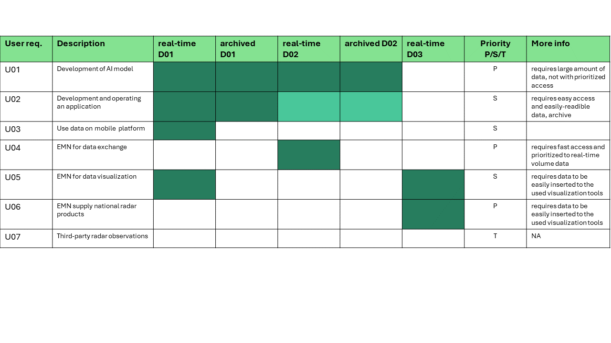

# RODEO WP6: OPERA Open Radar Data (ORD) Sharing Requirements

### Annakaisa v. Lerber (FMI), Vegar Kristiansen (METNO),  Morten Stig Andersen (DMI), Stuart J. Matthews (EUMETNET), Roope Tervo (EUMETSAT), Gijsbert Kruithof (KNMI), Mikko Rauhala (FMI), Vera Meyer (GeoSphere Austria), Christoph Müller (DWD) 
.

## Abstract

This document details the requirements for Work Package 6 (WP6) Tasks6.1-3 of the RODEO project, focusing on the sharing of Open Radar Data (ORD). It outlines the datasets to be included, the expected user requirements and objectives, as well as the technical specifications necessary for the development of an ORD supply.

The proposed solutions are designed to align with other APIs (Application Programming Interfaces) developed within the RODEO project, leveraging components from the EUMETNET Federated European Meteorological Data Infrastructure (FEMDI) programme. In T6.1-3 the aim is to build upon the data-sharing framework established by the EUMETNET OPERA programme over the past decade. The planned design is to create a data supply system for third-party users that aligns with the World Meteorological Organization’s (WMO) Information System 2.0 (WIS 2.0) strategy and complies with the European Union’s (EU) regulation on Meteorological High Value Data (HVD).

## Revision history
| Version | Date | Comment | Responsible
| :--- | :--- | :--- | :--- 
| 0.1 | 2024-01-14 | preliminary draft | Annakaisa v. Lerber
| 0.2 | 2024-02-09 | added dataset description, user requirements for review | Annakaisa v. Lerber
| 0.3 | 2024-03-08 | Rewrite based on requrements for OPERA Open Radar Data Sharing F01 -F35 | Vegar Kristiansen
| 0.4 | 2024-04-09 | Added the Business requirements done by Morten | Annakaisa von Lerber
| 1.0 | 2024-06-28 | Reviewed documentation for milestone MS16 | Annakaisa von Lerber

## Table of Content
- [Introduction](#Introduction)
- [Dataset description](#Dataset-description)
- [User requirements](#User-requirements)
- [System requirements](#System-requirements)
- [Functional and non-functional requirements](#Functional-and-non-functional-requirements)
- [Business requirements](#Business-requirements)
- [Dependencies](#Dependencies)
- [Constraints and assumptions](#Constraints-and-assumptions)
- [Risks](#Risks)
- [Conclusions](#Conclusions)

## Introduction
This document describes the requirements in the RODEO WP6 for sharing Open Radar Data (ORD). It outlines the technical requirements and objectives for the development of ORD supply. The proposed solutions are designed to align with other Application Programming Interfaces (APIs) developed within the RODEO project, particularly with the design in WP3, while leveraging components from the EUMETNET Federated European Meteorological Data Infrastructure (FEMDI) programme. The aim is to build upon the data-sharing framework established by the EUMETNET OPERA programme over the past decade. The planned design intends to create a data supply system that serves not only the meteorological community but also third-party users, in alignment with the World Meteorological Organization’s (WMO) Information System 2.0 (WIS 2.0) strategy and in compliance with the European Union’s (EU) regulation on Meteorological High Value Data (HVD). 

This document is intended for the WP6 development team, stakeholders, and anyone interested in the technical specifications of ORD supply. It includes a detailed description of the system’s functional and non-functional requirements, acceptance criteria, and risks.

We hope that this document will serve as a clear guide for the development and implementation of work performed in T6.3 for radar data supply and help ensure its successful integration with the FEMDI programme and within RODEO-project.

## Dataset description

In this section we describe the datasets that are planned to be supplied by the RODEO developed APIs. In short, these are stated in the Table 1. 

Table 1. Open radar datasets in WP6 for supplying in RODEO 
| N | Data type | Spatial coverage | Temporal coverage | Timeliness |Availability| Data Owner/licensing | Period | Data model and format | Metadata standard | More Info
| :--- | :--- | :--- | :--- | :--- |:---| :--- |:--- | :--- | :--- | :---
| D01a| OPERA Composite: ODYSSEY maximum reflectivity  | 2 x 2 km, Cartesian grid covering the whole of Europe (area 3800 × 4400 km2) | every 15 minutes | delivery in (&#124;T2 – T1&#124; ≤ 1020 s) > 90 % |(&#124;T2 – T1&#124; ≤ 1800 s) > 99 % | EUMETNET | 2011 -10/2024  | ODIM (BUFR and HDF5) | ODIM |
| D01b| OPERA Composite: CIRRUS maximum reflectivity  | 1 x 1 km, Cartesian grid covering the whole of Europe (area 3800 × 4400 km2) | every 5 minutes | delivery (&#124;T2 – T1&#124; ≤ 420 s) > 90 % | (&#124;T2 – T1&#124; ≤ 600 s) > 99 % | EUMETNET | 01/2024 - | ODIM 2.4 HDF5 | ODIM |
| D01c| OPERA Composite: ODYSSEY Surface rain rate | 2 x 2 km, Cartesian grid covering the whole of Europe (area 3800 × 4400 km2)   | every 15 minutes | delivery in (&#124;T2 – T1&#124; ≤ 1020 s) > 90 % |(&#124;T2 – T1&#124; ≤ 1800 s) > 99 % | EUMETNET | 2011 - 10/2024  | ODIM (BUFR and HDF5) | ODIM |
| D01d| OPERA Composite: NIMBUS Surface rain rate | 2 x 2 km,Cartesian grid covering the whole of Europe (area 3800 × 4400 km2)   | every 15 minutes | delivery in (&#124;T2 – T1&#124; ≤ 1020 s) > 90 % |(&#124;T2 – T1&#124; ≤ 1800 s) > 99 % | EUMETNET | 06/2024 -  | ODIM 2.4 HDF5) | ODIM |
| D01e| OPERA Composite: ODYSSEY 1 hour accumulation | 2 x 2 km,Cartesian grid covering the whole of Europe (area 3800 × 4400 km2) | hourly | delivery in (&#124;T2 – T1&#124; ≤ 1020 s) > 90 % |(&#124;T2 – T1&#124; ≤ 1800 s) > 99 % | EUMETNET | 2011 - 10/2024  | ODIM (BUFR and HDF5) | ODIM |
| D01f| OPERA Composite: NIMBUS 1 hour accumulation | 2 x 2 km Cartesian grid covering the whole of Europe (area 3800 × 4400 km2)  |hourly | delivery in (&#124;T2 – T1&#124; ≤ 1020 s) > 90 % |(&#124;T2 – T1&#124; ≤ 1800 s) > 99 % | EUMETNET | 06/2024 -  | ODIM 2.4 HDF5 | ODIM |
| D02a| OPERA volume radar data: DBZH (filtered, "best possible" horirizontal reflectivty factor), TH (unfiltered horizontal reflectivity factor), VRADH (horizontal radial velocity)  | resolution varies 125 m - 1000 m covering 150 -300 km  | 5-15 minutes| >= 0 to < 5 minutes after the nominal time| >= 95%  | Data provider | 2011 - | ODIM (BUFR and HDF5)| ODIM |
| D02b| OPERA volume radar data: new variables  | resolution  125 m - 1000 m covering 150 -300 km  | 5-15 minutes| >= 0 to < 5 minutes after the nominal time| >= 95%  | Data provider | 2026 - | ODIM HDF5 or FM301 NetCdf| ODIM, FM301 |
| D03a | National products: reflectivity composite | resolution  125 m - 1000 m | 1-15 minutes | varies | varies| Data provider|  | varies ODIM HDF5, GeoTiff | |
| D03b | National products: precipitation composite  | resolution  125 m - 1000 m | 1-15 minutes | varies | varies| Data provider|  | varies ODIM HDF5, GeoTiff | |
| D03c | National products: wind profiles  | n/a | 1-15 minutes | varies | varies| Data provider|  | BUFR | |
| D03d | National products: echo top  | resolution  125 m - 1000 m | 1-15 minutes | varies | varies | Data provider|  |varies GeoTiff | |

### OPERA Composite Data D01

The composites cover the whole of Europe (area: 3,800 × 4,400 km2) in a Lambert Equal Area projection with appox. corner coordinates: 70 N 30 W, 70N 50E, 32N 15W, 32 N 30E. In ODYSSEY production (D01a, D01c, D01e) covering years of 01/2011- 10/2024, the composites are all updated every 15 minutes, and issued ca. 15 minutes after data time with 2 x 2 km resolution. The example image of ODYSSEY maximum reflectivity composite is shown in Figure 1. In the new production (01/2024 - ) the CIRRUS products are with higher spatial resolution of 1 x 1 km and update cycle of 5 minutes. The composite products are based on incoming polar scans and volumes of filtered reflecitvity. 

Figure 1. An example of OPERA ODYSSEY maximum reflectivity composite.

There are three products on offer from the OPERA suite of products:
 
#### OPERA Instantaneous Maximum Reflectivity (in dBz) (D01a, D01b)
- In the maximum reflectivity composite each composite pixel contains the maximum of all polar cell values of the contributing radars at that location.
- ODYSSEY production 2012-10/2024 and CIRRUS production 01/2024 -
  
#### Instantaneous Surface Rain rate composite (in mm/h) (D01c, D01d)
- ODYSSEY production 2012-10/2024 and NIMBUS production 06/2024 -
- In the ODYSSEY rain rate composite, each composite pixel is a weighted average of the valid pixels of the contributing radars, weighted by a quality index, the distance from center of the pixel and an exponential index related to inverse of the beam altitude. Whereas in NIMBUS production the compositing algorithm is based on the lowest elevation angle only.
- Measured reflectivity values are converted to rainfall (mm/h) using the Marshall-Palmer equation.

#### OPERA One Hour rainfall Accumulation (in mm) (D01e, D01f)
- Rainfall accumulation is the sum of the previous four 15-minute rain-rate products.
- ODYSSEY production 2012-10/2024 and NIMBUS production 06/2024 -

Four quality filters are applied to the volume data prior to compositing (Saltikoff et al. 2019). Two methods were initially utilized since 2011: an anomaly-removal module and a hit-accumulation filter. The anomaly-removal module utilizes computer vision techniques to detect patterns often associated with non-weather-related sources, such as straight lines or single pixels. It assigns a probability of precipitation to the data as an initial quality indicator and discards non-precipitation pixels by setting values exceeding a threshold to nodata. The hit-accumulation clutter filter calculates a normalized echo count (or occurrence frequency) monthly. Pixels with a normalized echo count exceeding a threshold in each radar scan are identified as residual clutter, typically set at 0.6.

In late 2015, two additional methods were introduced: Beam blockage correction and a satellite-based filter for residual non-precipitation echoes. Beam blockage correction involves calculating beam blockage percentage in polar coordinates using a 1 km digital elevation model (GTOPO30) and a geometric propagation model. Pre-calculated values are then used to adjust reflectivity, with values in partially blocked sectors corrected and given less weight in composite products. Reflectivity values in sectors with blockage exceeding 70% are set to nodata.

The satellite filter is based on the EUMETSAT Nowcasting SAF Precipitating Clouds product, which provides a probability of precipitation. The filter considers the 49 surrounding satellite pixels for each radar pixel with a detected echo, accounting for time gaps between radar and satellite observations and parallax effects. The maximum probability serves as the third quality index, and if the probability of precipitation is 0, the reflectivity is marked as undetectable.

The used data sharing model in OPERA is in-house deveoped ODIM (OPERA Data Information Model) both in BUFR and HDF5 for older production, solely HDF5 for the new production. The current ODIM specifications can be found from [EUMETNET OPERA weather radar information model for
implementation with the HDF5 file format
Version 2.4](https://www.eumetnet.eu/wp-content/uploads/2021/07/ODIM_H5_v2.4.pdf). 
An example of the metadata structures of ODYSSEY, which uses ODIM 2.0 format while NIMBUS composites follows ODIM 2.4, are illustrated in Figure 2 and the metadata structure of NIMBUS products are also depicted in ANNEX1: Annex/ANNEX1_NIMBUS_composite_metadata_07032024.pdf.

### OPERA Database

OPERA Database is manually maintained table by the OPERA data providers and by the Croatian Meteorological and Hydrological Service (DHMZ). It is sporadically updated, minimum twice a year. The available formats are json, xlsx and csv and it can be automatically pushed to service provider. The fields it includes are stated in the Table 2 and example file is attached as ANNEX2 [OPERA database in csv](https://github.com/EURODEO/opera-requirements/blob/main/Annex/ANNEX2_OPERA_RADARS_DB_2024_02.csv).  

Table 2. OPERA Database content.
| Field | Unit/Format | Description | Example 
| :--- | :--- | :--- | :--- 
| Number | 1111 | Internal identifier of radar in database | 1218
| Country | x | Country | Croatia
| Country ID | CCCCii | Country ID |LDZM42
| Old Country ID | AA11Old | Country ID | (optional)RH42
| WMO Code | 11111 | WMO Code| 14256
| WIGOS Station Identifier | | WIGOS Station Identifier |
| ODIM Code |aaaaa | ODIM Code | hrbil| 
| Location | x | Name of location | Bilogora
| OPERA Status | 0 / 1 | OPERA active or inactive | 1 
| Latitude | 1.2345° | Latitude of radar (WGS84) | 45.8834
| Longitude |1.2345° | Longitude of radar (WGS84) |17.2008
| Height of Station | 1 m | Height of radar station | 258
| Band | S/C/X | S, C or X band radar |S 
| Doppler | Y/N | | Y
| Polarization | S/D |Single or dual polarization| S 
| Max Range | 1 km | Maximum range of radar (lowest elevation) | 240
| Start Year |YYYY | Year when the radar site first was taken into use | 1994
| Year of the most recent upgrade | YYYY | Year of the most recent upgrade | 
| Height Antenna | 1 m | Height of radar antenna + height of radar station | 275
| Antenna Diameter | 1.2 m | Antenna diameter | 3.7 
| Beam | 1.23° | Beam width | 2.1
| Gain | 1.2 dB | Antenna gain | 38.5
| Frequency | 1.234 GHz | Frequency | 2.800
  
### National volume radar data (D02a, D02b)
Via the ORD API, the plan is to supply the incoming OPERA radar volume data as it is collected from the EUMETNET radar data providers. Typically, the number of incoming OPERA files is around 340,000 per day, amounting to approximately 45 GB daily. The data generally includes unfiltered reflectivity factor (TH), Doppler-filtered and cleaned reflectivity factor, known as "best possible" reflectivity (DBZH), and radial velocity data (VRADH). However, the scanning strategies, data processing chains with chosen thresholds and algorithms, definitions of scanning time, spatial and temporal resolution of data, and file structures vary nationally, resulting in heterogeneous datasets. The data can be sent as volumes or on a scan-by-scan basis, with radar variables either combined in the same file or separated into different files. The scans are typically optimized either for high-quality reflectivity factor observations or for unambiguous radial velocity measurements. The dealiasing of VRADH is not consistently performed nationally, and currently, it is also not applied centrally in OPERA.

The OPERA volume data archive dates back to 2011, but the data exhibits significant variability over the years. The older datasets can be  quite different from the newer ones. The ODIM standard has been followed since the inception of OPERA volume data exchange; older datasets are usually in BUFR format, while newer ones are in HDF5. ODIM data format model versions 2.0 to 2.4 have been applied, but these are not always backward compatible. Due to computational resource constraints, the plan for ORD supply does not include converting the older radar datasets to HDF5 or newer versions of ODIM; this conversion is left to the users. Some encoders or links to encoders are provided.

The typical radar file metadata (ODIM 2.3) includes general information (refer in ANNEX 3 [OPERA incoming data](Annex/ANNEX3_OPERA_Incoming_Data_Cumulus.xlsx)): 
* REFERENCE_DATE (d), type Date
* COUNTRY (ctry), type String
* COUNTRY_ID (ctryid), type String
* STATION_NUMBER (stno), type Integer
* STATION_LOCAL_ID (stid), type String
* QUANTITY (quant), type String
* FILENAME (fn), type String
* ANTENNA_ELEVATION (ae), type Float
* WAVELENGTH (wl), type Float
* LATITUDE (lat), type Float
* LONGITUDE (long), type Float
* HEIGHT (h), type Float
		
and special information:
* PROD_IDA1 (pida1), type String
* PROD_IDA2 (pida2), type String
* FILE_FORMAT (ff), type String
* FILE_MODE (fm), type String
* FORMAT_VERSION (fv), type String
* DECODE_DATE (dedat), type Date
* STORE_DATE (stdat), type Date
     

### National composites or products (D03a-d)

**FMI national products D03**

FMI could demonstrate the ORD API with D3a (reflectivity composite), D3b (precipitation composites), and D3d (echo top) products:
1. Radar reflectivity factor in dBZ.
2. Rainfall intensity R, in units of mm/h and 1, 12, and 24-hour rainfall accumulation (mm).

Products for variables 1. and 2. are available with a 5-minute time resolution. Composite products are displayed in a Cartesian coordinate system with a 1 km resolution in GeoTIFF format.

3. In addition to the aforementioned products, FMI national suite has Echo top - product (etop_20), which represents the maximum height of strong or moderate echoes at each point. Its height unit is presented in kilometers and spatial resolution is same as with composites  with a 1 km resolution and offered format is GeoTIFF.

All data and resulting data products have undergone signal processing stages where:
* Stationary objects have been removed using ground clutter filtering.
* Weakest signals have been thresholded to prevent radar system-induced thermal noise from interfering with measurement data.
* Strongest ground clutter signals have been thresholded to ensure that the ratio between ground clutter signal and weather signal does not exceed a set radar-specific threshold.

In addition to these, the following post-processing steps have been applied to the radar compositing data:
* Distance correction derived from the rain vertical distribution to transform measurements made higher in the atmosphere to surface-level measurements.
* Removal of non-meteorological echoes.
* Transformation of radar reflectivity factor depending on precipitation type to rainfall intensity.

**KNMI National products D03**
KNMI could demonstrate the ORD API with D3a (reflectivity composite), D3b (precipitation composites), and D3d (echo top) products: 
* https://dataplatform.knmi.nl/dataset/radar-reflectivity-composites-2-0
"Gridded files of radar reflectivities at 1500 m over the Netherlands and surrounding area measured by two radars in Herwijnen and Den Helder. Time interval is 5 minutes."
format: hdf5
* https://dataplatform.knmi.nl/dataset/radar-echotopheight-5min-1-0
  "Gridded files of radar echo top heights over the Netherlands and surrounding area. Based on 15 radar scans by two radars in Herwijnen and Den Helder. Time interval is 5 minutes."
  format: hdf5
* https://dataplatform.knmi.nl/dataset/nl-rdr-data-rtcor-5m-1-0
"Gridded files of radar-derived 5 minute precipitation accumulations, corrected by rain gauge data. Radar data over the Netherlands and surrounding area measured by Dutch, Belgian, and German radars are corrected by available data from automatic rain gauges. Time interval is 5 minutes." format: hdf5

**METNO national products D03** 

METNO could demonstrate the RODEO interface with a mosiac covering the Nordic countries with D03a (reflectivity) and D03b (precipitation):
1. Radar reflectivity factor in dBZ
2. Rainfall intensity R, in units of mm/h

A national mosiac covering Norway could be made available with D03a (reflectivity) and D03b (precipitation)

Products for D02 are available in 5-minutes time resolution. The mosaic covering the Nordic countries could be made available in ODIM H5, and GeoTIFF format.

All data and resulting data products have undergone signal processing stages where:
* Removal of non-meteorological echoes (sea clutter)
* Stationary objects have been removed using ground clutter filtering.
* Transformation of radar reflectivity factor depending on precipitation type to rainfall intensity.

### Prioritizing FAIR-principles related to weather radar data

The expectation of EU Digital Funding is that the funded APIs are developed according to the FAIR (Findability, Accessibility, Interoperability, and Reusability) principles. These principles emphasize machine-actionability, meaning the ability of computational systems to find, access, interoperate, and reuse data with minimal or no human intervention. The principles pertain to three types of entities: data (or any digital object), metadata (information about that digital object), and infrastructure. For instance, principle F4 states that both metadata and data should be registered or indexed in a searchable resource (the infrastructure component).

It has been noted that datasets in ORD can partially fulfill the requirements of FAIR, though not entirely. Table 3 identifies and prioritizes which datasets meet the FAIR principles and outlines actions to achieve compliance where they do not.

Weather radar datasets typically consist of measurements over long time series, during which new signal processing methods and algorithms have been applied. However, version control is not specifically defined. Additionally, for OPERA production (D01), specific software releases over the years are not consistently registered, making it challenging to apply persistent identifiers such as DOIs to these datasets. Furthermore, the ownership of OPERA products (D01) belongs to EUMETNET, so national entities cannot assign identifiers. Nevertheless, OPERA data products can be identified and researched using their metadata, thereby seen to fulfil the Findability principle. Also for national volume data (D02), datasets can be uniquely identified with a timestamp, WSI (WIGOS Station Identifier), or a temporary ID created by the API system in the backend log. These datasets can be referenced via the metadata database, making D02 datasets persistent and compliant, as the API can redirect to the same data source if needed.

Regarding the datasets supplied via the ORD API, accessibility is considered compliant since datasets are available from the API when needed.

OPERA composite data (D01) can be published under an agreed license in RODEO (TBD), which can be applied in the metadata. For national products (D03) or single-site radar (D02) data, this responsibility lies with the NMS's radar data providers.

OPERA and the datasets collected via OPERA, follow the ODIM standard, meaning the data and metadata adhere to community standards. However, converters and vocabulary mapping to conventions such as CF (Climate and Forecast) conventions will be developed later if needed.

Table 3. FAIR principles with priorization defined as Primary (P)/Secondary (S)/Tertiary (T)/Not applied during RODEO (NA)
| FAIR | Description | D01 real-time OPERA composites | D01 archived OPERA composites| D02 real-time OPERA volume data  | D02 archived volume data | D03 real-time National products | More Info 
| :--- | :--- |  :--- |  :--- |  :--- |  :--- |  :--- |  :---
| **Findable** | Metadata and data should be easy to find for both humans and computers. Machine-readable metadata are essential for automatic discovery of datasets and services | P | P  | NA  | NA  | NA | 
| **F1** | (Meta)data are assigned a globally unique and persistent identifier | The OPERA datasets D01 can be indentified with unique identifier, but cannot be linked to persistent ID system such as DOI due to the nature of continous (version control), the data EUMETNET ownership, and historical datasets |  same as on the right|  national effort |  national effort |  national effort|  
| **F2** |  Data are described with rich metadata (defined by R1 below) | Compliant with ODIM | Compliant with ODIM | Compliant with ODIM | Compliant with ODIM | Compliant with ODIM | The metadata needs to read from the data files, version control is not really compliant 
| **F3** | Metadata clearly and explicitly include the identifier of the data they describe | Compliant with ODIM  | Compliant with ODIM | Compliant with ODIM | Compliant with ODIM  | National effort | 
| **F4** | (Meta)data are registered or indexed in a searchable resource | Discovery metadata database is implemented | Discovery metadata database is implemented | Discovery metadata database is implemented | Discovery metadata database is implemented | ODIM compliant metadata and discovery meatadata can be read, otherwise national effort | 
| **Accesible** |Once the user finds the required data, she/he/they need to know how they can be accessed, possibly including authentication and authorisation. | P | P | P  | P | NA | 
| **A1** | (Meta)data are retrievable by their identifier using a standardised communications protocol | planned to be compliant | planned to be compliant | planned to be compliant | planned to be compliant | national effort |  
| **A1.1** | The protocol is open, free, and universally implementable | planned to be compliant | planned to be compliant  | planned to be compliant | planned to be compliant | planned to be compliant | 
| **A1.2** | The protocol allows for an authentication and authorisation procedure, where necessary | TBD in FEMDI API Gateway | TBD | TBD | TBD  | TBD | 
| **A2** |  Metadata are accessible, even when the data are no longer available | TBD | TBD  | TBD | TBD | national efforts | 
| **Interoperable** |The data usually need to be integrated with other data. In addition, the data need to interoperate with applications or workflows for analysis, storage, and processing. | S | S | S | S | NA | 
| **I1** | (Meta)data use a formal, accessible, shared, and broadly applicable language for knowledge representation. | ODIM compliant | ODIM compliant  | ODIM compliant | ODIM compliant | national effort |  
| **I2** | (Meta)data use vocabularies that follow FAIR principles | ODIM, later can be used mapping to CF conventions if needed | same | same | same | national effort | 
| **I3** | (Meta)data include qualified references to other (meta)data | TBD | TBD | TBD | TBD | national effort | 
| **Reusable** | Metadata and data should be well-described so that they can be replicated and/or combined in different settings. | S | S | S | S | NA  | 
| **R1** | (Meta)data use a formal, accessible, shared, and broadly applicable language for knowledge representation. | planned to be compliant | planned to be compliant  | planned to be compliant | planned to be compliant | national efforts |  
| **R1.1** | (Meta)data are released with a clear and accessible data usage license. | TBD | TBD  | national effort | national effort | national effort | 
| **R1.2** | (Meta)data are associated with detailed provenance | TBD | TBD  | national effort |  national effort  |  national effort | 
| **R1.3** | (Meta)data meet domain-relevant community standards | ODIM  | ODIM | ODIM  | ODIM  | national effort  | 

## User requirements

This section represents the use cases and the requirements based on these user needs. Some of the use cases are stated also in the FEMDI (WP2) and ORD (WP6) requirement documentation. These are stated at each use case. The short descriptions of the use cases specified in the Table 4. aligned with the datasets they are utilizing. 

Table 4. User requirements in short.

### U01 A company or public institute, where a data scientist who wants to use radar data in their machine learning model (training and operational) environment. 

Related to use cases in FEMDI 2.4.

“As a big data consumer, I want a single unified view of available meteorological datasets in machine-readable formats and large-scale data usage/re-processing, dataset needed for training a Machine Learning (ML) model and then running it. This innovative use of met data, will help bring step-change advances to technological solutions for understanding and forecasting the weather and its impacts events.”  

*Requirements:* 

- Requires datasets D01 OPERA composite or D02 OPERA volume radar data with a large archive (the back-end archive to be established in EWC)
- Requires a suitable access mechanism for bulk consumption (rather than download), e.g. access through S3 in cloud native formats to download directly to avoid download store.
- The execution of the trained AI model requires the real-time to be consistent with the training data (i.e., from the same source)
- Requirement is to provide converters/readers for the old data. Here RODEO WP6 T6.4 could provide suitable tools when they are also developing the suitable AI datasets.
- Data consumption is large in the case of radar volumes, but not time critical. This sets requirement for priorization of data supply for real-time use of volume data.
- Requires that data could be searched by e.g. by radar identification, coordinates (radar location information should be in the discovery metadata), time ,  radar quantity (DBZH, TH, VRADH), format, elevation angle
- Requires that the OPERA volume data which is not part of the HVD is prohibited to be not be supplied by ORD
  
*Priority:* 
- Primary
  
*Clarifications:* 
- The OPERA volume radar data archive includes both ODIM files both in BUFR and HDF5. The older ones are in BUFR format.
- The user case defines that a metadata database is needed with the discovery metadata for searching data. The metadata database structure for both the archived or 24-cache datasets should be the same. For composites it may be diffrent.

*Acceptance criteria:* 
- Suggestion for WP6 T6.4 (ECMWF) to be a test user or some other met institute developing AI tools. The acceptance criteria would be that a test user can download data efficiently, calculate an dataset based on data fetched via the API and converted it to format they can read.

*Consequences and decisions:* 
- Due to computational resources, ORD supply will not convert the old archive to HDF5, nor will it split the volume files to single elevation files, but archives the data as it is in the OPERA archive. Therefore, the requirement is to provide the converters/readers for the old data for the users. Collaboration can be with OPERA Expert Team and [xradar - community](https://github.com/openradar/xradar)
- To find test users, possible collaboration with WP6 T6.4 (ECMWF)
  

### U02 A Small & Medium Enterprise (SME) application developer who wants to see what data sets are available, access them and build an application based on OPERA data  

Related to use cases in FEMDI 2.5 and ORD

“As a new data consumer, I want a single unified view of available meteorological datasets which are updated on a regular basis, that is easily accessible and findable, is easily integrated into my systems and can be re-used (i.e. following FAIR principles). This will allow me to develop an application which makes best use of the available data to add value to the users and bring me in an income.”  

*Requirements:* 
- D01 datasets are the primary use but e.g. aviation application developer may would like to have 3D - volume data (then this is similar to U01)
- Requirement is to identify a suitable datasets via the FEMDI Shared Catalogue and determine, which of the datasets are suitable for running application.
- The mobile application can quickly become popular and is installed on over 10,000 devices. Each device makes a few requests a day as the user changes location, and this adds up to lots of requests on the data supply component’s API.
- Data should be easily readable, requires e.g. that datasets are availbale in cloud-optimized GeoTiff (composites only) in addition to HDF5
- Requires a manual how to use the data
- For D01, the search can be done by time, but no need by coordinates. The supply will be always for the whole composite.
- Potentially can lead to a lot of requests and processing on the data source, therefore would require priority use by authorization.    

*Priority:*  
- secondary 

*Clarifications:* 

*Acceptance criteria:* 
- Performance validation tests for the API with test users (agree this with WP7) - to be able to download archived GeoTiffs (composites) via API and to be able to download real-time GeoTiffs via API with the defined timeliness and availability (TBD).

*Consequences and decisions:* 
- Sets system requirement of authorized access for data for prioritising data flow
- Data conversion to cloud-optimised GeoTiff for D01. This is performed for the whole archive. 
- Requires descision of the perfomrance level offered for different datasets in RODEO  

### U03 A member of a public organisation who wants to see real time weather radar visualised on their mobile.  

Related to use cases in FEMDI 2.6 and ORD

“As a traffic officer manager, I want to use my smart phone to regularly check the rainfall amounts across my country and bordering countries in Europe, so I can be prepared for different driving conditions, and potential impacts on the traffic network and people’s safety. This will allow me to rapidly respond with appropriate resources and equipment to incidents.”   

*Requirements:* 
- Similar to U02 in respect to the system requirements
 
*Priority:* 
- secondary

*Clarifications:* 
- This U03 will not introduce new system requirements to U02.
- Potential additional use case to be considered 

*Acceptance criteria:* 
- same as U02

*Consequences and decisions:* 
- Visualisation is out of scope of FEMDI and also ORD supply. The responsibilty of the ORD API will end to supply the data.

### U04 - EUMETNET Members uses RODEO for data exchange

“EUMETNET members want to replace the bilateral data exchange with ORD supply. They want the 3D-volume data as fast as possible as a high priority user. They are familiar with the data formats and the radar data processing. They will build their national forecasting services on this data.”  

*Requirements:*
- Requires 3D-volume radar data (real-time D02)
- Requires automized fetching of data from an interface, automized set of rules for selecting data (radar identification, location, radar quantities, elevation angles) 
- A 24 - hour cache is suitable, doesn't require the large archive
- Requires the authorization and priorization for the data use
- Reqiures a fast connection to data, no in-between processing
- For redundancy, could require a two sets of 24-hour caches in two separate locations.

*Priority:*
- primary

*Clarifications:*
- Clarification can the direct links to S3 be used, are there any security limitations in this solution.
- The plans of WP2 FEMDI API gateway for authorization
- The structure of S3 archive, to define the optimized speed to use the archive.  
   
*Acceptance criteria:*
- Performance validation results for fetching different sizes of data batches in the defined timeliness, availablity and completeness with a test user.

*Consequences and decisions:*
- The SLAs for RODEO needs to be defined following the QoS planned.
- Prioritized data use (clarify if WP2 FEMDI is supporting this)
- If no security issues, build direct links to S3 for EUMETNET members to have fast access to the data.
- Clarify the need for redundancy and the cost implications. 

### U05 EUMETNET members are visualising OPERA products in the forecasting services

“EUMETNET members want to show the composite products on their forecasting services for official duty purposes. They want the composite data as fast as possible, high priority user. They are familiar with the data formats and the radar data processing. ”  

*Requirements:*
- D01 OPERA composite data is already supplied to NMSs, the added value of ORD API needs to be clarified. 
- Automized fetching of data (direct S3 download)
- Requirement would be a map-service (WMS-layer) functionality to the system
- National datasets D03 could be provided (the map service should be at NMSs'end)

*Priority:*
- Secondary

*Clarifications:*

*Acceptance criteria:*
- The D01 and D03 products can be fetched via API with the agreed SLA via API and presented on GeoWeb

*Consequences and decisions:*
- GeoWeb is used as demonstration tool
- ORD is not going to provide map-service
- The D01 composites are converted to cloud-optimied Geotiffs 

### U06 - National Met Service is supplying their national radar products (composites, echo tops, vertical wind profiles) to third party users 

“As a EU members I have to fulfill the HVD Implementation Act, and RODEO provides a common interface which is also good for the third-party users to obtain radar data products from the same interface. This user requirement is following the federated distribution of data.”  

*Requirements:*
- This use case will include radar data products (D03) only, no national volume data, this is included in U04
- Set of decided formats (data, metadata) that can be offered through this API. Requires the definition which of the products, formats/model, metadata structure are applicable for ORD API 
- Federated distribution, no archive, possible 24 - hour cache.
- Requires metadata ingestion to be defined 

*Priority:* 
- Primary

*Clarifications:*
- the SLA for this service is nationally dependent, there needs to be agreed combined SLA how the ORD API supplies D03 products 

*Acceptance criteria:*
Demonstration that project partners (METNO, FMI, DMI and KNMI) can offer their products from their open interfaces, these can be downloaded accroding to SLA and fetched from the Data Catalogue and visualized on GeoWeb. 

*Consequences and decisions:*
- GeoWb is used as demonstration tool, no map service is offered.
- Metadata ingestion needs to be defined.  
- ODIM HDF5 and cloud-optimized GeoTiff are the supplied formats.
- This use case requires a manual for the possible end users how datasets can be supplied via ORD API
  

### U07 - radar data observations from 3rd parties

Related to E-SOH requirement 4.5.

“I'm representative of e.g. hydrological services or a private company and I own radar data. I would like to include supply my radar data via ORD developed APIs.”  

*Requirements:*
- Set requirements to agree on licensing 

*Priority:*
- tertiary
  
*Clarifications:*
- External provider should be applicable to OPERA rules for data ingestion or in case of products defined in U06
- ORD supply will take only external radar data or products via NMSs, then this user requirement is following similar to datasets D02 or in the case of products OD3
- OPERA is making quality and complience checks before accepting the data or products to the data flow. ORD supply does not have resources to do this. 

*Acceptance criteria:*

*Consequences and decisions:*
- Suggestion is not to leave this requirement out of the scope of ORD supply.

## Functional and non-functional requirements

In this section are listed the functional and non-functional requirements which are stemed from the user requirements. A summary is provided in the Table 5. 

### F01 - operational service

"As an consumer of radar data, I want the system to be operational. So, I can build my operational services based on ORD supply."

*Priority:*
- primary

*Clarifications:*
- Operational service includes e.g. documentation, stable production fulfillig the defined service level of timeliness, availability and completness, possible also includes redundancy. The system perfromance should be monitored and reported. 
- This is the main goal set for the requirements, the below defined requirements are to explanatory to this. Requirements F02 to F06 describe the service levels required.

*Acceptance criteria:*
- When implementation is in place, define a certain test period, where the timeliness, availability and completness of the system are tested and reported. 

*Consequences and decisions:*
- ORD supply will be an operational service, providing core capability on behalf of EUMETNET Members.  

### F02 - 24/7 availability

"As an consumer of ORD supply, I want the service to be available 24/7 with minimal agreed downtime and maintenance slots. So, I can deliver the level of service required by my users."

*Priority:*
- primary

*Clarifications:*
- There is an expectation for data to be consistently available 24/7, although a minimum of downtime (<1%) is acceptable with no break in service > 24hours.
- There is an expectation to deliver the 24/7 level of service, a "service desk" capability will be required to handle the disruptions in data flow.
- The consequences of downtime need to specified. The ingestion and data access downtime need to seprated, also centralized and federated components need to be viewed individually.
- The meaning of service desk needs to be clarified and the level of automatisation.
- System is planned to fulfill the defined service level with taking into account the available resources.
  
*Acceptance criteria:*
- Similar to F01 to have a testing period to examine the availability of the system. The avalability should be monitored continously.

*Consequences and decisions:*
- ORD supply is designed and build to be available 24/7
- Service desk function is planned to be performed together with the other dataset supplies possibly in FEMDI (WP2), no 24/7 service to fix the errors in data flow can be promised.
- For now, dublicated system at EWC is not planned (meaning e.g. 24-cache archive in both EWC computational centres), but should be also considred as operational use of the supply should have redundancy in place.  

### F03 - delivery within one minute

"As an consumer of ORD, I want volumes and composites to be available within 1 minute of data is publishing by the OPERA hub and production. So, I can deliver the level of service required by my users."

*Priority:*
 - primary

*Clarifications:*
- ORD supply should not cause any significant delay in sharing time-critical data

*Acceptance criteria:*
- once API is implemented, the fastness of the data flow must be monitored and validated.

*Consequences and decisions:*
- The OPERA volumen data and the products are ingested from DWD, GeoSphere Austria, and Météo France with the ingest-API. The perfromance of the ingest API must be considered carfully, e.g. how much discovery metadata information is read from the file and how much from the filename to save time.
      
### F04 - file delivered within a minute of the youngest observation within the file 

"As an consumer of ORD, I want the files available for downloading within a minute of the youngest observation within the file. So, I can deliver the level of service required by my users."

*Priority:*
- primary

*Clarifications:*
- Similar to F03, more related to files sent as volumes.
- More a data provider requirement but the system throughput should no add any additional delay.

*Acceptance criteria:*
- same as F03

*Consequences and decisions:*
- same as F03

### F05 - data producers to make the data they create available with minimum delay

"As the ORD system operator, I want data producers of national products to make the data they create available with minimum delay. So, I can deliver the level of service required by my users."

*Priority:*
- primary

*Clarifications:*
- This is a requirement for the data providers.
- For OPERA datasets D01 and D02, these are monitored in the EUMETNET Quality Monitoring Portal.
- For D03, this is seen as the national responsibility.

*Acceptance criteria:*
- NA

*Consequences and decisions:*
- This is out of the scope of ORD supply operations. 

### F06 - agreed delivery data format and protocol

"As the ORD supply, I want data producers to make the data they create available in an agreed data format and following an agreed delivery protocol. So, I can deliver the level of service required by my users."

*Priority:*
- primary

*Clarifications:*
- ODIM HDF is mandatory for volumes (archive is also in BUFR or HDF5) and composites (converted to cloud-optimized GeoTiff in ORD supply)
- The archive is supplied in its native format and links for converters are provided (e.g. xradar)
- In future, the data may be also available in WMO FM301 (based on CFradial2, netcdf), this requires future development after the RODEO project. Some of the work will be in considred in OPERA. 
- Discussion if composites with other formats can be supplied directly from national interfaces (D03) as the data is stored locally at each NMS or sent to EWC S3 bucket with their national tendancy (TBD). This may be a problem for metadata ingestion.  
- Ingest API will send the notification when the data has arrived to S3 or national storage.
- Pointer needs to url-based and suitable for web-based clients (GeoWeb), but recommended to save the listing in as EDR-compliant.
- Make the radar data as easy as possible for GeoWeb
- Discussion is there a difference between short-term and long-term archives.  

*Acceptance criteria:*
- The decision of the supported formats should be clearly indicated to the users of the ORD supply.
  
*Consequences and decisions*:
- OPERA composites (D01) are converted to cloud-optimized GeoTiffs in ORD while ingesting
- Delivery will be done in S3 buckets
- The supported data formats for national product files are ODIM HDF5 or cloud-optimized GeoTiff.

### F07 - reports of the performance against agreed KPIs

"As a EUMETNET Member, I want monthly, quarterly, and annual reports of the performance, against agreed KPIs, of the ORD supply. So, I am assured that the level of service is at agreed levels and meeting our users’ requirements. Also, so I have an indication of possible future investment needs."

*Priority:*
- primary

*Clarifications:*
- It is mandatory to make this as an automatic solution. No manual work should be required for monitoring the system.
- The solution depends on the system used in EWC for survailance.
- For monitoring we use the created database (as in WP3 E-SOH), visualization are shown with Grafana.
- S3 (uptime) can be monitored if its available. This will be implemented in EWC, and then WP3 E-SOH and WP6 ORD supply can reuse this.
- Requires documentation of the monitoring 
- FEMDI is monitored and surveilance data can be gathered from there, but the direct downloading pypasses these statistics (no user statiscs)
- In near future, it should be noted that EWC will not get the monitoring data from the S3 use, but this may change in the long run. 

*Acceptance criteria:*
- Monitoring results and report are demonstrated. 

*Consequences and decisions:*
- Firstly to clarify how much monitoring is done in WP2 FEMDI, then build a suitable log-files for monitoring the performance of ORD supply.
- Database is created for the monitoring data (log-files)
- Monitoring is presented with the Granfana software.
- Noting here that with direct use of S3 buckets, the user information cannot be gathered. 

### F08 - data application providers to only provide supported operating systems, libraries, and software

"As the ORD system operator, I want data application providers to only provide supported operating systems, libraries, and software. So, I can minimise the costs of managing the lifecycle of Open Radar Data."

*Priority:*
 - primary

*Clarifications:*
- This states that the goal is to build the service on exisiting and openly availble software, but system components can also be home-made for the purpose of the project.

*Acceptance criteria:*
- NA
  
*Consequences and decisions:*
- The open-source libraries or software in the development are emphasized. 
  
### F09 - access to real-time ORD up to 24 hours after the observations data time

"As a data consumer, I want access to ORD, up to 24 hours after the nominal time of the radar data is produced. So, I can retrieve data I might have missed due to, for example, local technical incidents."

*Priority:*
- primary

*Clarifications:*
- Data consumers might choose to archive data themselves. This is common among EUMETNET Members as it, for example, allows Members to run re-analysis trials based on the data reception, rather than validity time.
- It should be possible to overwrite the archive e.g. with new processed data. DWD may send data twice to 24 - hour cache, but new data should just overwrite the old data

*Acceptance criteria:*
- NA

*Consequences and decisions:*
- The real-time OPERA composite (D01) and volume radar data (D02) should have the 24-cache to retrieve the data, after this the user can fetch it from the archive
- ORD will not offer 24- hour cache service for the national products (OD3), this is dependent on the national resources. 
  

### F10 - ORD must perform its data provider role within FEMDI when a data producer exposes data in an approved format

"Given a data producer/OPERA exposes data in an approved format, when new data are received by ORD, then ORD supply must perform its data provider role within FEMDI."

*Priority:*
- primary

*Clarifications:*
- For national products (OD3) no data is transfered from NMS. Only notification and a link/URL to localy stored data or S3 bucket at EWC (NMS's own tendancy)  

*Acceptance criteria:*
- The required formats are documented.

*Consequences and decisions:*
- ODIM HDF format is used for all mandatory data, and cloud-optmized GeoTiffs for the products
- For archive of single site radar data both HDF5 and BUFR will be handled
- Pilot for national products (OD3) used by GeoWeb could devide from this requirement (TBD)

### F11 - reject corrupt data and record the event

"Given a data producer exposes data to ORD, when the metadata and/or data is found to be corrupt. Then ORD supply should reject the data and record the event."

*Priority:*
- primary

*Clarifications:*
- ORD gets the data directly either from OPERA or national data provider
- OPERA performs the ODIM compliancy checks and in general checks the datafile quality before letting the radar data provider send data to OPERA hub.
- The quality is radar data is responsiblity of the NMS.
- If the file is found to be corrupted, the system is able to remove the corrupted file in EUMETNET tendency 
- OPERA (DWD, MF, GeoSphere Austria) could have access to Grafana monitoring system
 
*Acceptance criteria:*
- Monitoring process should be documented.

*Consequences and decisions:*
- ORD only checkes the readibility of metadata and removes the file if this is not readible, otherwise no quality control is performed.
- Set a monitoring of the number corrupted files in place

### F12 - parameter naming convention standards, where not established, to be developed and followed

"As a ORD service operator, I want parameter naming convention standards, where not established, to be developed and followed. So, I can efficiently maintain and lifecycle the ORD service."

*Priority:*
- primary

*Clarifications:*
- Currently the vocabulary is taken from ODIM
- GeoTiff can use the ODIM vocabulary 
- This may change with WMO FM301, then the vocab service developed in WP2 FEMDI can be utilized in mapping the terminology.

*Acceptance criteria:*
- NA

*Consequences and decisions*
- Currently ODIM vocabulary is going to be used.
  
### F13 - near real-time access to ORD via a publish-subscribe message pattern

"As a data consumer of ORD, I want near real-time access to observations via a publish-subscribe message pattern. So, I can minimise the development of new applications and reduce the need to rely on domain specific delivery methods."

*Priority:*
- primary

*Clarifications:*
- This only applicable for the short-time archive.
  
*Acceptance criteria:*

*Consequences and decisions:*
- Use the MQTT solution as used in WP3 E-SOH.
  
### F14 - ORD suuply to scale to user demands for data

"As a ORD system operator, I want ORD to scale to user demands for data, especially those users requesting data via the ORD API and pub/sub message pattern. So, I can deliver the service expected by data consumers."

*Priority:*
- primary

*Clarifications:*
- This requires monitoring of the system performance
- Both input and output data should be considered separately.
- Expectation is that the number of users will not increase rapidly - API/database should no be the problem
- This requirement may have a financial constrain e.g. in S3 or FEMDI transfer cost 
  
*Acceptance criteria:*
- Demonstration and reporting of the monitoring

*Consequences and decisions:*
- Set up monitoring
- Build the API that it can be scalable
- Service level (TBD) should be set accordingly.

### F15 - query based on datasets, location, time, and parameters

"As a data consumer using API access, for volume radar data I want to query the radar sites based on location, radar name, bounding box, time, quantity, and possible elevation angles and for the OPERA composites to quary on time and composite products and for national composites to query on producer, area, time, and quantity. So I can access exactly the data I require and minimised the amount of data retrieved and local post processing." 

*Priority:*
 - primary

*Clarifications:*
- In one volume radar file there can be all the elevation angles included as well as quantities.
- Filtering by country name.
- Follow EDR standards for location and time
- OPERA database should be automatically updated in this ORD database, with priority taken from metadata. In the case of conflict found and automatic email should be sent to OPERA database provider (DHMZ).  
  
*Acceptance criteria:*
- once implemented, the performance should be demonstrated and documented.
   
*Consequences and decisions:*
- At this stage we expect to use EDR as the standard for the API so we should use the EDR standards for location and time. To start with, we will focus on simple radius and 2D polygon queries, and not worry about trajectories, etc.  There is still the open question about parameters but for location and time hopefully we can state EDR.
- the other query items are ingested into the metadata database from the files.

### F16 - pub-sub message pattern to be compliant with the requirements of WIS 2.0

"As a EUMETNET Member, I want the method of delivery via a pub-sub message pattern to be compliant with the requirements of WIS 2.0. So, I can efficiently meet my obligations as a WMO Member."

*Priority:*
 - primary

*Clarifications:*

  
*Acceptance criteria:*
- NA
  
*Consequences and decisions:*
- Reuse method used in WP3 E-SOH

### F17 - ORD software to meet agreed quality assurance standards

"As a ORD system operator, I want ORD software to meet agreed quality assurance standards. So, I can efficiently maintain and lifecycle the service."

*Priority:*
- primary

*Clarifications:*

*Acceptance criteria:*
- NA
  
*Consequences and decisions:*
- Here are relied on the NMSs' own software quality assurance standards.

### F18 - contributions to the ORD code base to be open to all EUMETNET members

"As a EUMETNET Member, I want contributions to the ORD code base to be open to all Members. So, I can efficiently deliver my national and EUMETNET Strategy."

*Priority:*
- primary

*Clarifications:*
- Codebase is placed on github.com, under the EUMETNET organisation
- In RODEO, all software is open.

*Acceptance criteria:*
- NA
*Consequences and decisions:*
- NA
  
### F19 - security to be considered as a high priority

"As a ORD system operator, I want security to be considered as a high priority and all aspects of the system to meet IT security best practice and includes, for example, identity and access management, role- based access controls, access tokens and data encryption at rest and in transit. So, I can deliver a robust and secure system."

*Priority:*
- primary

*Clarifications:*
- Data ingestion (Only aplicable for dissimination of national products (D03))
   * There must be control of who are allowed to upload data to the system. Also, there may be several systems for uploading data. SFTP may be one of them, while others may depend on http post requests. This means that each system for ingesting data may need its own mechanisms for authentication, and possibly also authorization. If possible, it would be useful to have a common "source of truth" regarding authorization, regardless of authentication mechanism.
- Administration and monitoring
   * Access to administration and statistics about the system should not be freely available to anyone. Some system must be set up to allow access to relevant users only.
- Data delivery
   * In the first version of ORD supply, there will be no restricted data, so from that perspective there is no need for authentication or authorization (Restriction is done at OPERA level), except for priorization.
   * If, at a later stage, we will introduce access control here, there seems to be some limitations in FEMDI regarding this: The use of a message queue implies that anyone will be able to know about the *existence* of restricted data. We can only provide access control on the actual data itself. 
   * Even if we want to only serve freely available data, we may still want to have some kind of access control here, to have some protection against servers becoming overloaded.
- Security monitoring
   * Some system must be in place to allow admins to monitor the system with regards to security incidents.
- Data encryption
   * All traffic to and from the system will use encryption. No usage of http, only https. The same applies to ftp - we will only provides sftp.

*Acceptance criteria:*

*Consequences and decisions:*
- We will follow the security measures of the NMSs security measures in software development.
- We expect to implement encryption using secure protocols such as, e.g. HTTPS. Stored observation data will not be encrypted. Identity and Access Management (IAM) will depend on infrastructure implementations of which restrictions may apply, e.g., at EWC.
- We follow the FEMDI stated processes in access control

### F20 - sufficient compute resources

"As a ORD system operator, I want sufficient compute resource to be available. So, I can deliver a resilient and sustainable service to my users."

*Priority:*
- primary

*Clarifications:*
- The required compute resource for OPERA ORD is thought to be relatively low, especially compared with the requirements of NWP, satellites and even radar processing.
- The storage requirements are modest where only 24 hours of storage is required.
- In the case of archive data seperat storage requirements will be placed.
- Consideration also needs to be given to the requirements for resilience and for development environments. Depending on the resilience architecture and the need for development environments there might be several instances of ORD running in parallel to the operational system. On the other hand, depending on the service of the cloud provider chosen, resilience might not need to be running in parallel and development environments may only exist when actively being used rather than being “always on”.
- As more radars are added to ORD or more quantaties the resource requirements will increase accordingly. 
- The ‘periphery’ components of ORD (e.g., monitoring and reporting) will also require compute resources, but these are believed to be significantly less than the core.

*Acceptance criteria:*

*Consequences and decisions:*
- The resources at EWC or similar service needs to be defined. Premilinary calculations have been submitted to EUMETNET.

## Business requirements

The business requirements in this section is covering the requirements that are related to WP6 for supplying ORD. 

### B01 - ORD supply to be a flexible pathway to exposing weather radar data observations

“As a EUMETNET Member, I want ORD supply to be flexible and be a pathway to exposing radar data from a single point of contact. So, I can deliver a consistent solution and reduce development activity.”

*Priority:*
- secondary

*Clarifications:*
 
*Acceptance criteria:*

*Consequences and decisions:*
- Documentation and education for members and other user groups are required to use this supply.

### B02 - adoption of a "build and share" approach to software development

“As a EUMETNET Member, I want the adoption of a "build and share" approach to software development. So, Members can efficiently and consistently develop their national capability related to FEMDI and beyond.” 

*Priority:*
- primary

*Clarifications:*
- The project description says that all software should be free and open-source similar to system requirements F08 and F18
- OPERA is committed to share OPERA software under the GPL3.0 license with decision of EUMETNET PFAC. 

*Acceptance criteria:*
- License should be defined and documented. 

*Consequences and decisions:*
- Software in RODEO is licensed with a free and open source license (TBD later)

### B03 - homogeneous data interoperability between EUMETNET Members and the wider community

“As a EUMETNET Member, I want the exchange of data, and data interoperability between EUMETNET Members and the wider community to be as homogenous as possible. So, I can meet part of my “Observations and Prediction Data” and “Science Technology and Infrastructure” Vision within the European NMHSs 2021-25 Strategy?.”

*Priority:*
- primary

*Clarifications:*
- The primary source of data in ORD is from OPERA, where a OPERA-developed common data model of ODIM (Michelson et al. 2021) is used for years.
- The national datasets (D03) are required to use ODIM in the case they are sending data in HDF5.
- WMO has decided to follow the developed FM301 data model in the global radar data exchange, the transition period is presumably be long. ORD should be ready to supply data also in this model and format (netcdf). OPERA will develop a suitable framework for changing from ODIM to FM301. Converters are offered by WMO, and OPERA will develop a suitable addition to that to meet the requirements of OPERA. 
- Current data formats are HDF5 and BUFR for archived data.
- Radar metadata for OPERA members is stored in OPERA database, WRD, and OSCAR database. The infromation is not necessarily aligned.
- We need to define use and discovery metadata that supports interoperability. Some station metadata (following a controlled vocabulary) should be required. 

*Acceptance criteria:*

*Consequences and decisions*
- RODEO project should provide converters from BUFR to HDF5/FM301
- WIGOS Station Identifiers (WSI) are not yet saved to OPERA Database. 
- Ignore restricted data in the beginning (i.e., data without a standard open license or release statement) 

### B04 - sustainable service

“As a EUMETNET Member, I want ORD supply to be a sustainable service that considers the whole lifecycle of a system from design, development, operations to retirement. So, I understand the total cost of ownership of the ORD service.”

*Priority:*
- primary

*Clarifications:*
- Only service and related costs of ORD part are considered. FEMDI is considered separately
- It is understood that estimating the full operational costs is extremely difficult. The fully costed estimate of the operational costs should include, for example, system life-cycling cost and reacting to emerging user needs.
- There is a general requirement for all EUMETNET Programmes to "ensure that the environmental footprint of the Programme is minimised where possible."
- Here. the sustainabilty is meant in operating cost, and in green computing

*Acceptance criteria:*

*Consequences and decisions:*
- Cost of ORD supply is defined for Autumn 2024 EUMETNET governing bodies.
 
### B05 - continuity of service

“As a EUMETNET Member, I want continuity of ORD supply in the event of the service operator changing. So, I have a sustainable service delivering my obligations.”

*Priority:*
- primary

*Clarifications:*
- The design and implementation should be developed such that the portability is maintained.

*Acceptance criteria:*

*Consequences and decisions:*
- TBD, is the service build on EWC or similar cloud service. This is still under negotiations. 

   
### B06 - existing Members’ capability considered for incorporation within RODEO

“As a EUMETNET Member, I want, wherever possible, existing Members’ (including ECMWF, EUMETSAT) capability (e.g., EWC) considered for incorporation within ORD supply. So, previous investment is exploited to its full potential.”

*Priority:*
- secondary

*Clarifications:*
- Currently the plan is to use EWC as a back-end for ORD supply (TBD).
- The big archive of incoming data is transferred from Météo France to EWC/DWD in 2024.

*Acceptance criteria:*

*Consequences and decisions:*
- The decision if EUMETNET members could allocate some of their national resources on EWC for ORD supply is not yet made.

### B07 - make observations available

“As a data owner of public sector information, I want to make my observations available. So, I can meet my legal requirements, e.g., European Union Open Data Directive (HVD) obligations.”

*Priority:*
- primary

*Clarifications:*
- If members are pushing their data to OPERA, they will be fulfilling the HVD requirements for volume radar data. For the composite data, there should be national solutions in place for the HVD requirement. However, the demonstration is planned to show that also national products can be availble through the developed ORD API.

*Acceptance criteria:*

*Consequences and decisions:*
The desicion of using of API also to supply national products (D03) should then fill the HVD regulations. 

### B08 - FAIR principles

“As a data owner, I want my data exposed following FAIR principles. So, I can meet my legal and user requirements.”

*Priority:*
- primary

*Clarifications:*
- The filled FAIR principles are stated in the section [Prioritizing FAIR-principles related to weather radar data](#Prioritizing_FAIR-principles_related_to_weather_radar_data)
- It is seen that many of the principles are fulfilled, however for national products (OD3) filling the most of the principles are seen as national effort.
- The FAIR, HVD and WIS2 requirements are not contradictory.
  
*Acceptance criteria:*

*Consequences and decisions:*
- The national datasets (OD3) are considred in the demonstration.  

### B09 - data exposed in a way that’s consistent with data exchange initiatives within EUMETNET, WMO and the wider data community

“As a data owner, I want my data exposed in a way that’s consistent with data exchange initiatives within EUMETNET, WMO and the wider data community. For example, WIS 2.0, INSPIRE, HVD, and FEMDI. So, I can meet my international commitments and obligations within the Meteorological and wider user community.”

*Priority:*
 - primary

*Clarifications:*

*Acceptance criteria:*

*Consequences and decisions:*
- As ORD supply development is done under the RODEO project, the aim is to fulfill all the requirements and targets of the enteties in coherent matter. 

### B10 - secure mechanism to share data according to data policy

“As a data owner, I want a secure mechanism to share data according to my data policy. So, I can use ORD supply to expose my data.”

*Priority:*
- primary

*Clarifications:*
- Radar data belongs to the data providor, e.g. UKMO doesn't need to follow the HVD, and most likely is not willing to share the volume data through RODEO. 
- Discussions on sharing all the OPERA data inside the composite must be agreed inside EUMETNET

*Acceptance criteria:*

*Consequences and decisions:*
- The restrictions in data sharing are performed at OPERA side.
- Discussions on data licensing/sharing as HVDs are done with collaboration of WP7. 

### B11 - observation station metadata

“As a data owner, I want metadata to be efficiently held and maintained within RODEO; synchronised with national, EUMETNET and international metadata stores (e.g., WMO OSCAR, WMO WRD); respecting the metadata agreed single source of truth. So, I am assured my data are represented correctly to radar data users and costs of metadata maintenance are minimised. ”

*Priority:*
- primary

*Clarifications:*
- There are discrepancies in OPERA Database, WMO Oscar and WMO WRD (World Radar Database), all of these are depending on manual filling.

*Acceptance criteria:*

*Consequences and decisions:*
- The metadata ingestion is taken directly from the files.

### B12 - radar observations delivered in the same format and exchange protocols as used today

“As a current data consumer of radar data, I want near radar observations delivered in the same format and exchange protocols as used today (i.e., HDF5 ODIM). So, I can minimise development of my systems downstream of RODEO.”

*Priority:*
- secondary

*Clarifications:*
- The real-time data flow can be arranged following the same standard than today, however the big archive has different data formats with BUFR, and HDF5 with different versions of ODIM.
- As stated these are not coing to be changed, but converters can be provided from the project.

*Acceptance criteria:*

*Consequences and decisions:*
- Chnage the Composite data OD1 to cloud optimized GeoTiff
- Provide converters from BUFR to HDF5, and possibly later to WMO FM301.  

## Dependencies

The API of choice for ORD supply will be OGC API EDR in line with the rest of the RODEO project. However, file based data and products will be mainly distributed via S3. WP2 (FEMDI) will provide a so called EDR profile which is to be followed also in ORD supply. Essentially it is an agreement between the project members on how the EDR implementation and data models are implemented. This is needed as the EDR specification is very permissible and interoperability cannot be guaranteed by only following the standard. This includes best practices on how to use the recommended CoverageJSON data model.

## Constraints and assumptions

The purpose of this sub-section is to document any limitations or assumptions that could impact the development of the system in order to ensure that the final product meets the users' needs and expectations. These constraints could include factors such as budget or time constraints, technical limitations, or any other factors that could affect the functionality or usability of the system. By identifying and addressing these constraints and assumptions early in the development process, we can minimize the risk of delays, misunderstandings, or unsatisfactory outcomes.

TBD later when the technical architecture solutions are defined based on the above mentioned requirements.

## Risks

This section defines the main risks seen in the design of the ORD supply. 

### R01 - No resources to implement ORD supply

*Priority:*
- primary

*Clarifications:*
- The resources to implement and run the ORD supply has not yet been secured. This has been on EUMETNET discussion for some time. The original idea was to used EWC, and then resources could be allocated from the joint national resources. The proposed solution is still under investigatation, and may lead to slowning the development and delay in implementation.
- In the case if funding cannot be secured for ORD supply, then this will most likely stop the development and ORD supplied cannot be delivered in the RODEO-project.    

*Mitigation:*
- Active negotiations between the EUMETNET members and EUMETNET Secretariat and in collaboration with EWC representatives of EUMETSAT and ECMWF. 

### R02 - No resources to operate ORD supply

*Priority:*
- primary

*Clarifications:*
- The risk is similar to R01.
- The funding for the operations of ORD supply is not yet secured
  
*Mitigation:*
- Active negotiations between the EUMETNET members and EUMETNET Secretariat to secure post-RODEO funding. 

### R03 - uncertainty of the operational platform

*Priority:*
- primary

*Clarifications:*
- The risk is similar to R01 and R02.
- Related to the uncertainty of R01, as no descision has not been made about the resources, there is no firm definition of the used platform on which ORD supply should be running. The expectation is, and also according to B06, EWC would be preferable option. At the moment, in ORD the test implementation is designed to be on EWC, in the case, the descision is to have the supply on other platform, some designed solutions may not be usable on the chosen platform leading to double work as well as most likely delay in the implementation.     
  
*Mitigation:*
- Active negotiations between the EUMETNET members and EUMETNET Secretariat to have descision on the used solution for providing the service.

### R04 - resources of ORD supply are not adequate

*Priority:*
- primary

*Clarifications:*
- The service levels and needed computational resource estimates are now based on use of the nationally-implemented open radar data supply. The national estimates are scaled up accoring to BKT (Gross domestic product) to European level. There is expectation for large interest on radar data, and therefore, the risk is that the resources are not adequate for the high demand.           
  
*Mitigation:*
- The ORD supply is planned to have scalability in diffrent parts of the system, which can then be ramped up if neede to have adequate service levels. 

### R05 - The defined service level cannot be not offered to primary users 

*Priority:*
- primary

*Clarifications:*
- The user requirement U04 requires a quick access to volume radar data, and is seen to replace the bilateral exchange between the EUMETNET members.
- The descision in WP2 FEMDI is not have autheticated use of the gateway, therefore the ORD supply cannot be prioritized for official duty use, thus can lead that the data needed at NMSs cannot be echanged enough fast. 
  
*Mitigation:*
- The ORD supply is planned to offer direct access to S3, which NMSs could use. However, there are still clarified, can in this direct access control the data flow and are there security issues (TBD).
  

## Conclusion

In conclusion, the requirements document outlines the specific needs and objectives of the RODEO WP6 Open Radar Data (ORD) supply, including functional and non-functional requirements. It should serve as a guide for the development team to ensure that the final product meets the expectations and requirements of EUMETNET, its associates and the expected end-users. The document should be regularly reviewed and updated throughout the project lifecycle to ensure that any changes or additions are properly documented and addressed. It is essential for the success of the project that all stakeholders agree on the requirements outlined in this document and use it as a reference throughout the development process.

## References

Michelson D. B., Lewandowski R., Szewczykowski M., Beekhuis H., Haase H., Mammen T., and D. Johnson, 2021: EUMETNET OPERA weather radar information model for implementation with the HDF5 file format Version 2.4. (www.eumetnet.eu/wp-content/uploads/2021/07/ODIM_H5_v2.4.pdf)

Saltikoff, E.; Haase, G.; Delobbe, L.; Gaussiat, N.; Martet, M.; Idziorek, D.; Leijnse, H.; Novák, P.; Lukach, M.; Stephan, K. OPERA the Radar Project. Atmosphere 2019, 10, 320. https://doi.org/10.3390/atmos10060320
