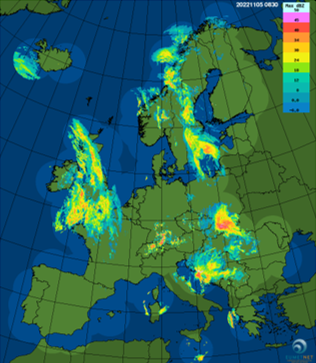
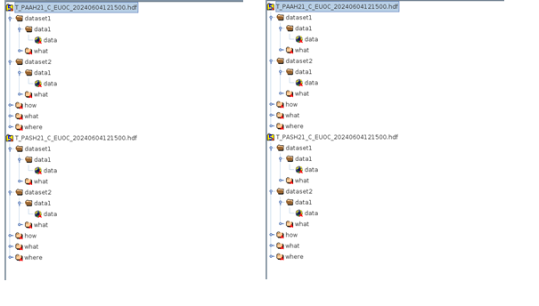

# RODEO WP6: OPERA Open Radar Data Sharing Requirements

### Annakaisa v. Lerber, Stuart J. Matthews, Roope Tervo, Gijsbert Kruithof, Mikko Rauhala, Vegar Kristiansen, Morten Stig Andersen, Vera Meyer, Christoph Müller, Daniel Heintze, Steffen Kremer 
.

## Abstract

This document details the requirements for Work Package 6 (WP6) Tasks6.1-3 of the RODEO project, focusing on the sharing of Open Radar Data (ORD). It outlines the datasets to be included, the expected user requirements and objectives, as well as the technical specifications necessary for the development of an ORD supply.

The proposed solutions are designed to align with other APIs (Application Programming Interfaces) developed within the RODEO project, leveraging components from the EUMETNET Federated European Meteorological Data Infrastructure (FEMDI) programme. In T6.1-3 the aim is to build upon the data-sharing framework established by the EUMETNET OPERA programme over the past decade. The planned design is to create a data supply system for third-party users that aligns with the World Meteorological Organization’s (WMO) Information System 2.0 (WIS 2.0) strategy and complies with the European Union’s (EU) regulation on Meteorological High Value Data (HVD).

## Revision history
| Version | Date | Comment | Responsible
| :--- | :--- | :--- | :--- 
| 0.1 | 2024-01-14 | preliminary draft | Annakaisa v. Lerber
| 0.2 | 2024-02-09 | added dataset description, user requirements for review | Annakaisa v. Lerber
| 0.3 | 2024-03-08 | Rewrite based on requrements for OPERA Open Radar Data Sharing F01 -F35 | Vegar Kristiansen
| 0.4 | 2024-04-09 | Added the Business requirements done by Morten | Annakaisa von Lerber
| 0.5 | 2024-06-22 | Reviewed documentation for milestone MS14 | Annakaisa von Lerber

## Table of Content
- [Introduction](#Introduction)
- [Dataset description](#Dataset_description)
- [User requirements](#User_requirements)
- [System requirements](#System_requirements)
- [Functional and non-functional requirements](#Functional_and_non-functional_requirements)
- [Business requirements](#Business_requirements)
- [Dependencies](#Dependencies)
- [Constraints and assumptions](#Constraints_and_assumptions)
- [Risks](#Risks)
- [Conclusions](#Conclusions)

## Introduction
This document describes the requirements in the RODEO WP6 for sharing Open Radar Data (ORD). It outlines the technical requirements and objectives for the development of ORD supply. The proposed solutions are designed to align with other Application Programming Interfaces (APIs) developed within the RODEO project, particularly with the design in WP3, while leveraging components from the EUMETNET Federated European Meteorological Data Infrastructure (FEMDI) programme. The aim is to build upon the data-sharing framework established by the EUMETNET OPERA programme over the past decade. The planned design intends to create a data supply system that serves not only the meteorological community but also third-party users, in alignment with the World Meteorological Organization’s (WMO) Information System 2.0 (WIS 2.0) strategy and in compliance with the European Union’s (EU) regulation on Meteorological High Value Data (HVD). 

This document is intended for the WP6 development team, stakeholders, and anyone interested in the technical specifications of ORD supply. It includes a detailed description of the system’s functional and non-functional requirements, acceptance criteria, and risks.

We hope that this document will serve as a clear guide for the development and implementation of work performed in T6.3 for radar data supply and help ensure its successful integration with the FEMDI programme and within RODEO-project.

## Dataset description

In this section we describe the datasets that are planned to be supplied by the RODEO developed APIs. In short, these are stated in the Table 1. 

Table 1. Weather radar datasets in WP6 for supplying in RODEO 
| N | Data type | Spatial coverage | Temporal coverage | Timeliness |Availability| Data Owner/licensing | Period | Data model and format | Metadata standard | More Info
| :--- | :--- | :--- | :--- | :--- |:---| :--- |:--- | :--- | :--- | :---
| D01a| OPERA Composite: ODYSSEY maximum reflectivity  | 2 x 2 km, Cartesian grid covering the whole of Europe (area 3800 × 4400 km2) | every 15 minutes | delivery in (&#124;T2 – T1&#124; ≤ 1020 s) > 90 % |(&#124;T2 – T1&#124; ≤ 1800 s) > 99 % | EUMETNET | 2011 -10/2024  | ODIM (BUFR and HDF5) | ODIM |
| D01b| OPERA Composite: CIRRUS maximum reflectivity  | 1 x 1 km, Cartesian grid covering the whole of Europe (area 3800 × 4400 km2) | every 5 minutes | delivery (&#124;T2 – T1&#124; ≤ 420 s) > 90 % | (&#124;T2 – T1&#124; ≤ 600 s) > 99 % | EUMETNET | 01/2024 - | ODIM 2.4 HDF5 | ODIM |
| D01c| OPERA Composite: ODYSSEY Surface rain rate | 2 x 2 km, Cartesian grid covering the whole of Europe (area 3800 × 4400 km2)   | every 15 minutes | delivery in (&#124;T2 – T1&#124; ≤ 1020 s) > 90 % |(&#124;T2 – T1&#124; ≤ 1800 s) > 99 % | EUMETNET | 2011 - 10/2024  | ODIM (BUFR and HDF5) | ODIM |
| D01d| OPERA Composite: NIMBUS Surface rain rate | 2 x 2 km,Cartesian grid covering the whole of Europe (area 3800 × 4400 km2)   | every 15 minutes | delivery in (&#124;T2 – T1&#124; ≤ 1020 s) > 90 % |(&#124;T2 – T1&#124; ≤ 1800 s) > 99 % | EUMETNET | 06/2024 -  | ODIM 2.4 HDF5) | ODIM |
| D01e| OPERA Composite: ODYSSEY 1 hour accumulation | 2 x 2 km,Cartesian grid covering the whole of Europe (area 3800 × 4400 km2) | hourly | delivery in (&#124;T2 – T1&#124; ≤ 1020 s) > 90 % |(&#124;T2 – T1&#124; ≤ 1800 s) > 99 % | EUMETNET | 2011 - 10/2024  | ODIM (BUFR and HDF5) | ODIM |
| D01f| OPERA Composite: NIMBUS 1 hour accumulation | 2 x 2 km Cartesian grid covering the whole of Europe (area 3800 × 4400 km2)  |hourly | delivery in (&#124;T2 – T1&#124; ≤ 1020 s) > 90 % |(&#124;T2 – T1&#124; ≤ 1800 s) > 99 % | EUMETNET | 06/2024 -  | ODIM 2.4 HDF5 | ODIM |
| D02a| OPERA volume radar data: DBZH (filtered, "best possible" horirizontal reflectivty factor), TH (unfiltered horizontal reflectivity factor), VRADH (horizontal radial velocity)  | resolution varies 125 m - 1000 m covering 150 -300 km  | 5-15 minutes| >= 0 to < 5 minutes after the nominal time| >= 95%  | Data provider | 2011 - | ODIM (BUFR and HDF5)| ODIM |
| D02b| OPERA volume radar data: new variables  | resolution  125 m - 1000 m covering 150 -300 km  | 5-15 minutes| >= 0 to < 5 minutes after the nominal time| >= 95%  | Data provider | 2026 - | ODIM HDF5 or FM301 NetCdf| ODIM, FM301 |
| D03a | National products: reflectivity composite | resolution  125 m - 1000 m | 1-15 minutes | varies | varies| Data provider|  | varies ODIM HDF5, GeoTiff | |
| D03b | National products: precipitation composite  | resolution  125 m - 1000 m | 1-15 minutes | varies | varies| Data provider|  | varies ODIM HDF5, GeoTiff | |
| D03c | National products: wind profiles  | n/a | 1-15 minutes | varies | varies| Data provider|  | BUFR | |
| D03d | National products: echo top  | resolution  125 m - 1000 m | 1-15 minutes | varies | varies | Data provider|  |varies GeoTiff | |

### OPERA Composite Data D01

The composites cover the whole of Europe (area: 3,800 × 4,400 km2) in a Lambert Equal Area projection with appox. corner coordinates: 70 N 30 W, 70N 50E, 32N 15W, 32 N 30E. In ODYSSEY production (D01a, D01c, D01e) covering years of 01/2011- 10/2024, the composites are all updated every 15 minutes, and issued ca. 15 minutes after data time with 2 x 2 km resolution. The example image of ODYSSEY maximum reflectivity composite is shown in Figure 1. In the new production (01/2024 - ) the CIRRUS products are with higher spatial resolution of 1 x 1 km and update cycle of 5 minutes. The composite products are based on incoming polar scans and volumes of filtered reflecitvity. 

Figure 1. An example of OPERA ODYSSEY maximum reflectivity composite.

Four quality filters are applied to the volume data prior to compositing (Saltikoff et al. 2019). Two methods were initially utilized since 2011: an anomaly-removal module and a hit-accumulation filter. The anomaly-removal module utilizes computer vision techniques to detect patterns often associated with non-weather-related sources, such as straight lines or single pixels. It assigns a probability of precipitation to the data as an initial quality indicator and discards non-precipitation pixels by setting values exceeding a threshold to nodata. The hit-accumulation clutter filter calculates a normalized echo count (or occurrence frequency) monthly. Pixels with a normalized echo count exceeding a threshold in each radar scan are identified as residual clutter, typically set at 0.6.

In late 2015, two additional methods were introduced: Beam blockage correction and a satellite-based filter for residual non-precipitation echoes. Beam blockage correction involves calculating beam blockage percentage in polar coordinates using a 1 km digital elevation model (GTOPO30) and a geometric propagation model. Pre-calculated values are then used to adjust reflectivity, with values in partially blocked sectors corrected and given less weight in composite products. Reflectivity values in sectors with blockage exceeding 70% are set to nodata.

The satellite filter is based on the EUMETSAT Nowcasting SAF Precipitating Clouds product, which provides a probability of precipitation. The filter considers the 49 surrounding satellite pixels for each radar pixel with a detected echo, accounting for time gaps between radar and satellite observations and parallax effects. The maximum probability serves as the third quality index, and if the probability of precipitation is 0, the reflectivity is marked as undetectable.

The used data sharing model in OPERA is in-house deveoped ODIM (OPERA Data Information Model) both in BUFR and HDF5 for older production, solely HDF5 for the new production. The current ODIM specifications can be found from [EUMETNET OPERA weather radar information model for
implementation with the HDF5 file format
Version 2.4](https://www.eumetnet.eu/wp-content/uploads/2021/07/ODIM_H5_v2.4.pdf). 
An example of the metadata structures of ODYSSEY, which uses ODIM 2.0 format while NIMBUS composites follows ODIM 2.4, are illustrated in Figure 2 and the metadata structure of NIMBUS products are also depicted in ANNEX1: Annex/ANNEX1_NIMBUS_composite_metadata_07032024.pdf.

There are three products on offer from the OPERA suite of products:
 
#### OPERA Instantaneous Maximum Reflectivity (in dBz) (D01a, D01b)
- In the maximum reflectivity composite each composite pixel contains the maximum of all polar cell values of the contributing radars at that location.
- ODYSSEY production 2012-2023 and CIRRUS production 2024 -

  
#### Instantaneous Surface Rain rate composite (in mm/h) (D01c, D01d)
- ODYSSEY production 2012-2023 and NIMBUS production 2024 -
- In the ODYSSEY rain rate composite, each composite pixel is a weighted average of the valid pixels of the contributing radars, weighted by a quality index, the distance from center of the pixel and an exponential index related to inverse of the beam altitude. Whereas in NIMBUS production the compositing algorithm is based on the lowest elevation angle only.
- Measured reflectivity values are converted to rainfall (mm/h) using the Marshall-Palmer equation.

#### OPERA One Hour rainfall Accumulation (in mm) (D01e, D01f)
- Rainfall accumulation is the sum of the previous four 15-minute rain-rate products.
- ODYSSEY production 2012-2023 and NIMBUS production 2024 -

### OPERA Database

OPERA Database is manually maintained table by the OPERA data providers and by the Croatian Met Services. It is sporadically updated, minimum twice a year. The available formats are json, xlsx and csv and it can be automatically pushed to service. The fields it includes are stated in the Table 2 and example file is attached as Annex [OPERA database in csv](https://github.com/EURODEO/opera-requirements/blob/main/Annex/OPERA_RADARS_DB_2024_02.csv).  

Table 2. OPERA database content.
| Field | Unit/Format | Description | Example 
| :--- | :--- | :--- | :--- 
| Number | 1111 | Internal identifier of radar in database | 1218
| Country | x | Country | Croatia
| Country ID | CCCCii | Country ID |LDZM42
| Old Country ID | AA11Old | Country ID | (optional)RH42
| WMO Code | 11111 | WMO Code| 14256
| WIGOS Station Identifier | | WIGOS Station Identifier |
| ODIM Code |aaaaa | ODIM Code | hrbil| 
| Location | x | Name of location | Bilogora
| OPERA Status | 0 / 1 | OPERA active or inactive | 1 
| Latitude | 1.2345° | Latitude of radar (WGS84) | 45.8834
| Longitude |1.2345° | Longitude of radar (WGS84) |17.2008
| Height of Station | 1 m | Height of radar station | 258
| Band | S/C/X | S, C or X band radar |S 
| Doppler | Y/N | | Y
| Polarization | S/D |Single or dual polarization| S 
| Max Range | 1 km | Maximum range of radar (lowest elevation) | 240
| Start Year |YYYY | Year when the radar site first was taken into use | 1994
| Year of the most recent upgrade | YYYY | Year of the most recent upgrade | 
| Height Antenna | 1 m | Height of radar antenna + height of radar station | 275
| Antenna Diameter | 1.2 m | Antenna diameter | 3.7 
| Beam | 1.23° | Beam width | 2.1
| Gain | 1.2 dB | Antenna gain | 38.5
| Frequency | 1.234 GHz | Frequency | 2.800
  
### National volume radar data (D02a, D02b)
- DBZH, TH, VRADH
- can be sent as volumes, or scan-by-scan, radar variables can be in the same file or seprately
- two types of scans, reflectivity or velocity - optimized
- in VRADH aliasing is not always performed.
- ODIM Data format model vr. 2-2.4 not always reverse compatible
- archive in different national BUFR version, there are some manual how to encode these
- the newer files in HDF
- various national scanning strategies, definitions of scanning time, spatial and temporal resolution.
- different quality processing levels 

OPERA - CUMULUS incoming data:

EDZW: 145000 Files/d 13.5 GB/d

LFPW: 40000 Files/d 2G B/d

ESWI: 30000 Files/d 2.5 GB/d

EFKL: 17000 Files/d 1.5 GB/d

EKMI: 1200 Files/d 1.5 GB/d

BIRK: 1500 Files/d 850 MB/d

LEMM: 3500 Files/d 500 MB/d

LPMG: 15000 Files/d 800MB/d

LYMB: 300 Files/d 70 MB/d

LZIB: 3400 Files/D 1.4 GB/d

LDZM: 1000 Files/d 600 MB/d

LSSW: 6400 Files/d 750 MB/d

ENMI: 7000 Files/d 5.5 GB/d

OKPR: 1700 Files/d 500MB/d

EBUM: 7700 Files/d 2 GB/d

EGRR: 36000 Files/d 3.5 GB/d

HABP: 5000 Files/d 1 GB/d

YRBK: 750 Files/d 150 MB/d

EIDB: 4700 Files/d 170 MB/d

SOWR: 5500 Files/d 1.1 GB/d

LJLM: 570 Files/d 280 MB/d

EVRR: 140 Files/d 40 MB/d

LLBD: 280 Files/d 2.5 GB/d

LGAT: 300 Files/d 65 MB/d

Summary : ca. 340000 Files/d with ca. 45GB/d

Data Format:
Info to ODIM Format (V2.3) located here:
https://www.eumetnet.eu/wp-content/uploads/2019/01/ODIM_H5_v23.pdf

Used metadata in DWD:

	Metadata set definition: 
 
 General information:
 
		Metadata field: REFERENCE_DATE (d), type Date
  
		Metadata field: COUNTRY (ctry), type String
  
		Metadata field: COUNTRY_ID (ctryid), type String
  
		Metadata field: STATION_NUMBER (stno), type Integer
  
		Metadata field: STATION_LOCAL_ID (stid), type String
  
		Metadata field: QUANTITY (quant), type String
  
		Metadata field: FILENAME (fn), type String
  
		Metadata field: ANTENNA_ELEVATION (ae), type Float
  
		Metadata field: WAVELENGTH (wl), type Float
  
		Metadata field: LATITUDE (lat), type Float
  
		Metadata field: LONGITUDE (long), type Float
  
		Metadata field: HEIGHT (h), type Float

Special information:

		Metadata field: PROD_IDA1 (pida1), type String
  
		Metadata field: PROD_IDA2 (pida2), type String
  
		Metadata field: FILE_FORMAT (ff), type String
  
		Metadata field: FILE_MODE (fm), type String
  
		Metadata field: FORMAT_VERSION (fv), type String
  
		Metadata field: DECODE_DATE (dedat), type Date
  
		Metadata field: STORE_DATE (stdat), type Date

#### National composites or products (D03a-d)
 - formats?
 - temporal and spatial resolution
 - included metadata

**FMI national products D3**
FMI could demonstrate the RODEO interface with D3a (reflectivity composite), D3b (precipitation composites), and D3d (echo top):
1. Radar reflectivity factor in dBZ.
2. Rainfall intensity R, in units of mm/h and 1, 12, and 24-hour rainfall accumulation (mm).

Products for variables 1. and 2. are available with a 5-minute time resolution. Composite products are displayed in a Cartesian coordinate system with a 1 km resolution in GeoTIFF format.

3. In addition to the aforementioned products, FMI national suite has Echo top - product (etop_20), which represents the maximum height of strong or moderate echoes at each point. Its height unit is presented in kilometers and spatial resolution is same as with composites  with a 1 km resolution and offered format is GeoTIFF.

All data and resulting data products have undergone signal processing stages where:
* Stationary objects have been removed using ground clutter filtering.
* Weakest signals have been thresholded to prevent radar system-induced thermal noise from interfering with measurement data.
* Strongest ground clutter signals have been thresholded to ensure that the ratio between ground clutter signal and weather signal does not exceed a set radar-specific threshold.

In addition to these, the following post-processing steps have been applied to the radar compositing data:
* Distance correction derived from the rain vertical distribution to transform measurements made higher in the atmosphere to surface-level measurements.
* Removal of non-meteorological echoes.
* Transformation of radar reflectivity factor depending on precipitation type to rainfall intensity.

**KNMI National products**
Probably those three: (Need to check this) 
* https://dataplatform.knmi.nl/dataset/radar-reflectivity-composites-2-0
"Gridded files of radar reflectivities at 1500 m over the Netherlands and surrounding area measured by two radars in Herwijnen and Den Helder. Time interval is 5 minutes."
format: hdf5
* https://dataplatform.knmi.nl/dataset/radar-echotopheight-5min-1-0
  "Gridded files of radar echo top heights over the Netherlands and surrounding area. Based on 15 radar scans by two radars in Herwijnen and Den Helder. Time interval is 5 minutes."
  format: hdf5
* https://dataplatform.knmi.nl/dataset/nl-rdr-data-rtcor-5m-1-0
"Gridded files of radar-derived 5 minute precipitation accumulations, corrected by rain gauge data. Radar data over the Netherlands and surrounding area measured by Dutch, Belgian, and German radars are corrected by available data from automatic rain gauges. Time interval is 5 minutes." format: hdf5

**Metadata description missing (?)**

### Prioritizing FAIR-principles related to weather radar data

The expectation of EU Digital Funding is that the funded APIs are developed according to FAIR (Findability, Accessibility, Interoperability, and Reuse of digital assets) - principles. The principles emphasise machine-actionability (i.e., the capacity of computational systems to find, access, interoperate, and reuse data with none or minimal human intervention). The principles refer to three types of entities: data (or any digital object), metadata (information about that digital object), and infrastructure. For instance, principle F4 defines that both metadata and data are registered or indexed in a searchable resource (the infrastructure component). Datasets in WP6 can partially fullfill the requirement of FAIR, but not fully. Here in Table 3 are identified and prioritized, which datasets fulfill the required FAIR-principles and if not, what are the actions either to make the dataset complient.   

Table 3. FAIR principles with priorization defined as Primary (P)/Secondary (S)/Tertiary (T)/Not applied during RODEO (NA)
| FAIR | Description | D01 real-time OPERA composites | D01 archived OPERA composites| D02 real-time OPERA volume data  | D02 archived volume data | D03 real-time National products | More Info 
| :--- | :--- |  :--- |  :--- |  :--- |  :--- |  :--- |  :---
| **Findable** | Metadata and data should be easy to find for both humans and computers. Machine-readable metadata are essential for automatic discovery of datasets and services |  |  |   |  |  | 
| **F1** | (Meta)data are assigned a globally unique and persistent identifier | P: ID for international dataset, version control, Annakaisa to clarify if this possible |  S: Can ID be given for historical data, e.g. version control|  NA: national effort |  NA: national effort |  NA: national effort. If such exists API should be able to push this information forward |  
| **F2** |  Data are described with rich metadata (defined by R1 below) | Compliant | Compliant | Compliant | Compliant | Compliant | The metadata needs to read from the data files, version control is not really compliant 
| **F3** | Metadata clearly and explicitly include the identifier of the data they describe |  |  |  |  |  | 
| **F4** | (Meta)data are registered or indexed in a searchable resource |  |  |  |  |  | 
| **Accesible** |Once the user finds the required data, she/he/they need to know how they can be accessed, possibly including authentication and authorisation. |  |  |   |  |  | 
| **A1** | (Meta)data are retrievable by their identifier using a standardised communications protocol |  |  |  |  |  |  
| **A1.1** | The protocol is open, free, and universally implementable |  |  |  |  |  | 
| **A1.2** | The protocol allows for an authentication and authorisation procedure, where necessary |  |  |  |  |  | 
| **A2** |  Metadata are accessible, even when the data are no longer available |  |  |  |  |  | 
| **Interoperable** |The data usually need to be integrated with other data. In addition, the data need to interoperate with applications or workflows for analysis, storage, and processing. |  |  |   |  |  | 
| **I1** | (Meta)data use a formal, accessible, shared, and broadly applicable language for knowledge representation. |  |  |  |  |  |  
| **I2** | (Meta)data use vocabularies that follow FAIR principles |  |  |  |  |  | 
| **I3** | (Meta)data include qualified references to other (meta)data |  |  |  |  |  | 
| **Reusable** | Metadata and data should be well-described so that they can be replicated and/or combined in different settings. |  |  |   |  |  | 
| **R1** | (Meta)data use a formal, accessible, shared, and broadly applicable language for knowledge representation. |  |  |  |  |  |  
| **R1.1** | (Meta)data are released with a clear and accessible data usage license. |  |  |  |  |  | 
| **R1.2** | (Meta)data are associated with detailed provenance |  |  |  |  |  | 
| **R1.3** | (Meta)data meet domain-relevant community standards |  |  |  |  |  | 

## User requirements

Description of use cases. Three of the use cases are stated also in the FEMDI documentation and four are related to E-SOH requirements. These are stated at each use case. The short descriptions of the use cases specified in the Table 4. aligned with the datasets they are utilizing. 

Table 4. User requirements in short 
| User requirement | Description | D01 real-time OPERA composites | D01 archived OPERA composites| D02 real-time OPERA volume data  | D02 archived volume data | D03 real-time National products | Primary (P)/Secondary (S)/Tertiary (T)| More Info 
| :--- | :--- | :--- | :--- | :--- |:---| :--- |:--- | :--- | 
| U01 | Development of AI model | X | X | X | X | | P | requires large amount of data, but not with prioritized access to develop, consistent data in operating the AI model| 
| U02 | Development and operating an application  | X | X | (X) | (X) | | S | requires easy access and easily-readible data, archive for development | 
| U03 | Use data on mobile | X | | | | | S | requires easy access and easily-readible data | 
| U04 | EMN for data exchange | | | X | | | P |requires fast access and prioritized to real-time volume data | 
| U05 | EMN for data visualization | X | | | | X | S |requires data to be easily inserted to the used visualization tools| 
| U06 | EMN supply national radar products | | | | | X | P |requires data to be easily inserted to the used visualization tools|
| U07 | Third-party radar observations | | | | | | T | N/A | 

### U01 A company or public institute, where a data scientist who wants to use radar data in their machine learning model (training and operational) environment. 

Related to use cases in FEMDI 2.4.

“As a big data consumer, I want a single unified view of available meteorological datasets in machine-readable formats and large-scale data usage / re-processing, dataset needed for training a Machine Learning (ML) model and then running it. This innovative use of met data, will help bring step-change advances to technological solutions for understanding and forecasting the weather and its impacts events.”  

*Requirements:* 

- Requires either D01 composite or D02 volume radar data with a large archive (the back-end archive to be established in EWC)
- Needs a suitable access mechanism for bulk consumption (rather than download), e.g. through S3 in cloud native formats to download directly to avoid download store.
- The execution of the trained AI model requires the real-time to be consistent with the training data (i.e., from the same source)
- The old archive includes country specific BUFR ODIM format files, the newer files are in HVDs, requirement is to provide converters/readers to the old data. Here WP6 T4 could provide suitable tools when they are also developing the suitable datasets.
- Data consumption is large in the case of radar volumes, but not time critical. This sets requirement for priorization of data supply
- Requires that data could be searched by radar-wise, by coordinate-wise (radar location information should be in the discovery metadata), time-wise, variable-wise, format-wise
- Requires license rights to data
-  
*Priority:* 
- secondary? Should this be primary accroding to EU Digital funding?

*Clarifications:* 
- metadata database is needed, will be a large task to define it, but not to extract this 
- Clarify metadata database structure both for the archived data or 24-cache, should be the same. 
- For composites the metadata database may be diffrent.
- Günther and Milka can provide infromation about the queries done at MF API or ODE
- Basic queries could be (check ODIM definitions): radar id, radar quantity (DBZH, TH, VRADH), time, product type (single site, composite), elevation angles?  

*Acceptance criteria:* 
- Suggestion: Could WP6 T4 (ECMWF) to be a test user here and when they can calculate an dataset based on data fetched via the API and converted it to format they can read.

*Consequences and decisions:* 
- Responsible to provide the converters/readers for the old data, collaboration with OPERA ET and xradar
- To engange WP6 T4 (ECMWF)
- requires the descision of how much we can follow FAIR-principles with the datasets
  

### U02 A Small & Medium Enterprise (SME) application developer who wants to see what data sets are available, access them and build an application based on OPERA data  

Related to use cases in FEMDI 2.5 and E-SOH 4.3.

“As a new data consumer, I want a single unified view of available meteorological datasets which are updated on a regular basis, that is easily accessible and findable, is easily integrated into my systems and can be re-used (i.e., following FAIR principles). This will allow me to develop an application which makes best use of the available data to add value to the users and bring me in an income.”  

*Requirements:* 
- Preseumably uses only D01 composite data, but e.g. aviation application developer may would like to have 3D - volume data (this is similar to U01)
- Requirement is to identify a suitable datasets via the FEMDI Shared Catalogue and determine which of the APIs for that dataset is suitable for running application.
- The mobile application quickly becomes popular and is installed on over 10,000 devices. Each device makes a few requests a day as the user changes location, and this adds up to lots of requests on the Data Supply component’s API.
- Data should be easily readable, requires e.g. that datasets are availbale in GeoTiff (composites only) in addition to HDF5
- Requires a manual how to use the data
- For D01, the search can be time-wise, but no need for spatial-wise. Always use the whole composite.
- Potentially can lead to a lot of requests and processing on the data source, thus, requires for priority use an authorization.    

*Priority:*  
-secondary 

*Clarifications:* 

*Acceptance criteria:* 
- Performance validation tests for the API - to be able to download archived GeoTiffs (composites) via API and to be able to download real-time GeoTiffs via API with the defined timeliness and availability.

*Consequences and decisions:* 
- Sets system requirement of authorized access for data for prioritising data flow
- Data conversion to GeoTiff
- Requires descision of the SLA we are offering for the datasets in RODEO 

### U03 A member of a public organisation who wants to see real time weather radar visualised on their mobile.  

Related to use cases in FEMDI 2.6 and E-SOH 4.4, and 4.5

“As a traffic officer manager, I want to use my smart phone to regularly check the rainfall amounts across my country and bordering countries in Europe, so I can be prepared for different driving conditions, and potential impacts on the traffic network and people’s safety. This will allow me to rapidly respond with appropriate resources and equipment to incidents.”   

*Requirements:* 
- Similar to U02 in respect to the system requirements
 
*Priority:* 
- secondary

*Clarifications:* 
- Visualisation is out of scope of FEMDI. The responsibilty of the RODEO API will end to supply the data. 
- Potential additional use case to be considered 

*Acceptance criteria:* 
- same as U02

*Consequences and decisions:* 
- This U03 will not introduce new system requirements to U02 

### U04 - EUMETNET Members uses RODEO for data exchange

“EUMETNET members want to replace the bilateral data exchange with RODEO. They want the 3D-volume data as fast as possible as a high priority user. They are familiar with the data formats and the radar data processing. They will build their national forecasting services on this data.”  

*Requirements:*
- requires 3D-volume radar data
- requires automized fetching of data from an interface, automized set of rules for selecting data (radar-wise, spatially, variables) 
- a 24 - hour cache is suitable, doesn't require the large archive
- requires the authorization and priorization for the data use
- reqiures a fast connection to data, no in-between processing  

*Priority:*
- primary

*Clarifications:*
- Clarify is the API providing links to S3 or to data (for composites)
   
*Acceptance criteria:*
- Perfromance validation results for fetching different sizes of data batches in the defined SLA of timeliness, availablity and completeness

*Consequences and decisions:*
- The SLAs for RODEO needs to be defined following the QoS planned.
- Prioritized data use (FEMDI is not supporting this at the moment)
- can bypass this with direct links to S3 fro EUMETNET members

### U05 EUMETNET members are visualising OPERA products in the forecasting services

“EUMETNET members want to show the composite products on their forecasting services for official duty purposes. They want the composite data as fast as possible, high priority user. They are familiar with the data formats and the radar data processing. ”  

*Requirements:*
- D01 OPERA composite data is already to NMSs, the added value of RODEO API needs to be clarified - can be taken out. Already provided by OPERA
- Automized fetching of data from an interface
- would require map-service (WMS-layer?) functionality to the system
- could provide also D03 national products (the map service is NMSs' side )

*Priority:*
- Secondary

*Clarifications:*

*Acceptance criteria:*
- The D01 and D03 products can be fetched via API with the agreed SLA via API and presented on GeoWeb

*Consequences and decisions:*
- Do we remove this requirement?
- Do we offer this MAP service?

### U06 - National Met Service is supplying their national radar products (composites, echo tops, vertical wind profiles) to third party users 

“As a EU members I have to fulfill the HVD Implementation Act, and RODEO provides a common interface which is also good for the third-party users to obtain radar data products from the same interface. This user requirement is following the federated distribution of data.”  

*Requirements:*
- Includes only radar data products (D03), no volume data, this is included in U04
- Requires the definition which of the products, formats/model, metadata structure are applicable for RODEO API 
- Federated distribution, no archive, with 24 - hour cache
- If the requirement is that products are visualized on GeoWeb, requires map service?
- Set of decided formats (data, metadata) that can be offered through this API
- Requires metadata ingestion to be defined 

*Priority:* 
- Primary

*Clarifications:*
- the SLA for this service is nationally dependent, there needs to be combined SLA how the API supplies the data products 

*Acceptance criteria:*
Demonstration that project partners (METNO, FMI, DMI and KNMI) can offer their products from their open interfaces, these can be downloaded accroding to SLA and fetched from the Data Catalogue and visualized on GeoWeb. 

*Consequences and decisions:*
- Which formats we agree on to offer to be served with API - HDF5 and/or GeoTiff
- Manual how data can be applied to RODEO API

### U07 - radar data observations from 3rd parties

Related to E-SOH requirement 4.5.

“I'm representative of e.g. hydrological services or a private company and I own radar data. I would like to include supply my radar data via RODEO developed APIs.”  

*Requirements:*
- External provideor should be applicable to OPERA rules for data ingestion or defined in U06
- Data compliency checks
- agreements for licensing 

*Priority:*
- tertiary
  
*Clarifications:*
- OPERA is making quality and complience checks before accepting the data or products to the data flow. Rodeo does not have resources to do this. 

*Acceptance criteria:*

*Consequences and decisions:*
Suggestion is not to accept this requirement U07.

## Functional and non-functional requirements

### F01 - operational service

"As an consumer of OPERA Open Radar Data, I want the sytem to be operational. So I can build my operational services based on WP6 Open radar data."

*Priority:*
- primary

*Clarifications:*
- What is the meaning of "operational service"?
- This is the main goal set for the requirements, the below defined requirements are to explanatory
- Open Radar Data will be a fully operational service, providing core capability on behalf of EUMETNET Members. Requirements F02 to F06 describe the Service levels required. 

*Acceptance criteria:*

*Consequences and decisions:*

### F02 - 24/7 availability

"As an consumer of OPERA Open Radar Data, I want the service to be available 24/7 with minimal agreed downtime and maintenance slots. So, I can deliver the level of service required by my users."

*Priority:*
- primary

*Clarifications:*
- There is an expectation for data to be consistently available 24/7, although a minimum of downtime (<1%) is acceptable with no break in service > 24hours.
- There is an expectation that to deliver this level of service, a "service desk" capability will be required so incidents can be managed.
- We need to figure out the consequences of any downtime
- We need to separate between ingestion and data access downtimes
- Centralized and federated components also need to be viewed individually
- We need to clarify the meaning of service desk. How automatic could this be?
- System is planned to fulfill the defined in the SLA. Depended on resources the service level can be changed.
- For now, dublicated system at EWC is not planned (meaning archive), but should be also considred. Operational use of real-time could be more applicable to have redundancy.  
  
*Acceptance criteria:*

*Consequences and decisions:*

### F03 - delivery within 1 minute

"As an consumer of Open Radar Data, I want volumes and composites to be available within 1 minute of data is publishing by the OPERA hub. So, I can deliver the level of service required by my users."

*Priority:*
 - primary

*Clarifications:*

*Acceptance criteria:*

*Consequences and decisions:*

### F04 - file delivered within a minute of the youngest observation within the file 

"As an consumer of Open Radar Data, I want the files available for downloading within a minute of the youngest observation within the file. So, I can deliver the level of service required by my users."

*Priority:*
- primary

*Clarifications:*
- Depending on who makes the batched file, this is a requirement on the data producer? Yes, but also on the system throughput.

*Acceptance criteria:*

*Consequences and decisions:*

### F05 - data producers to make the data they create available with minimum delay

"As the Open Radar Data system manager, I want data producers of national products to make the data they create available with minimum delay. So, I can deliver the level of service required by my users."

*Priority:*
- primary

*Clarifications:*

*Acceptance criteria:*

*Consequences and decisions:*

### F06 - agreed delivery data format and protocol

"As the Open Radar Data system manager, I want data producers to make the data they create available in an agreed data format and following an agreed delivery protocol. So, I can deliver the level of service required by my users."

*Priority:*
- primary

*Clarifications:*
- ODIM HDF is mandatory for volumes (archive is also in BUFR or HDF5) and composites (is also converted to GeoTiff)
- The archive is supplied in its native format
- links for converter (xradar)
- in future data may be also available in FM301 (based on CFradial2, netcdf) - future development of RODEO (after project) 
- Delivery will be done in S3 buckets
- the supported data formats for national product files are HDF5 or GeoTiff
- But also composites with other formats can be supplied directly from national interfaces as the data is stored locally at each NMS or sent to EWC S3 bucket
- Ingest API will send the notification when the data has arrived to S3 or national storage.
- Pointer needs to url-based and suitable for web-based clients (GeoWeb), but recommended to save the listing in as EDR-compliant.
- Make the radar data as easy as possible for GeoWeb (FMI is investigating the solution of optimized GeoTiff)

- Difference between short-term and long-term archives.
  

*Acceptance criteria:*

*Consequences and decisions*:

### F07 - reports of the performance against agreed KPIs

"As a EUMETNET Member, I want monthly, quarterly, and annual reports of the performance, against agreed KPIs, of the Open Radar Data service. So, I am assured that the level of service is at agreed levels and meeting our users’ requirements. Also, so I have an indication of possible future investment needs."

*Priority:*
- primary

*Clarifications:*
- It is mandatory to make this as a self service sollution. No manual work should be required for monitoring the system.
- Depends on the system used in EWC for survailance.
- For monitoring we use database (as E-SOH), visualization shown in Grafana
- S3 (uptime) can be monitored if its available. This will be implented in EWC, and E-SOH and Open radar data can reuse this.
- Document how monioring is done in WP6
- FEMDI is monitored and surveilance data can be gathered from there, but the direct downloading pypasses these statistics (no user statiscs)
- In near future, the EWC will not get the monitoring data from the S3 use, but this may change in the long run. 

*Acceptance criteria:*

*Consequences and decisions:*

### F08 - data application providers to only provide supported operating systems, libraries, and software

"As the Open Radar Data system manager, I want data application providers to only provide supported operating systems, libraries, and software. So, I can minimise the costs of managing the lifecycle of Open Radar Data."

*Priority:*
 - primary

*Clarifications:*
- It does not mean that system components could not be home made for the purpos of the project.
- trying to emphasize the open-source libraries or software in the development.
  

*Acceptance criteria:*

*Consequences and decisions:*

### F09 - access to real-time open radar data up to 24 hours after the observations data time

"As a data consumer, I want access to open radar data, up to 24 hours after the nominal time of the radar data is produced. So, I can retrieve data I might have missed due to, for example, local technical incidents."

*Priority:*
- primary

*Clarifications:*
- Data consumers might choose to archive data themselves. This is common amongst Members as it, for example, allows Members to run re-analysis trials based on the data reception, rather than validity, time.
- it is not impossible to overwrite the archive e.g. with new processed data. DWD may send data twice to 24 cache, but this should just overwrite the old data

*Acceptance criteria:*

*Consequences and decisions:*

### F10 - access to the first iteration as well as corrected observations data

"As a data consumer of file-based Open Radar Data, I want access to the first iteration of the observations data, as well as to late or subsequently corrected observations. So, I am able to handle all data."

*Priority:*
- secondary

*Clarifications:*
 - data and corrected data are in the same file, and these are overwritten in the case of resending the data.
  
*Acceptance criteria:*

*Consequences and decisions:*

### F11 - Open Radar Data must perform its data provider role within FEMDI when a data producer exposes data in an approved format

"Given a data producer/OPERA exposes data in an approved format, when new data are received by Open Radar Data, then Open Radar Data must perform its data provider roll within FEMDI."

*Priority:*
- primary

*Clarifications:*
- No data from NMS is transfered. Only notification and a link/URL to localy stored data or S3 bucket at EWC (NMS's own tendancy)  
- ODIM HDF is used for all data mandataory data.
- For archive of single site radar data both HDF5 and BUFR will be handled
- Pilot for national composites and files used by GeoWeb could devide from this requirement

*Acceptance criteria:*

*Consequences and decisions:*

### F12 - reject corrupt data and record the event

"Given a data producer exposes data to Open Radar Data, when the metadata and/or data is found to be corrupt. Then OPERA Open Radar Data should reject the data and record the event."

*Priority:*
 - primary

*Clarifications:*
 - OPERA HUB disiminates all data to Open Radar Data.
 - The Open radar data only checkes the readibility of metadata and removes the file if this is not readible, otherwise no quality control is performed.
 - The quality is radar data is responsiblity of the NMS
 - If the file is found to be corrupted, the system is able to remove the corrupted file in EUMETNET tendency 
 - ODIM validation is not done prior to sending,  it is done by OPERA when the NMSs is testing the data transfer.
 - Monitoring of the number corrupted files
 - OPERA (DWD, MF, GeoSphere Austria) could have access to Grafana monitoring system
 
*Acceptance criteria:*

*Consequences and decisions:*

### F13 - parameter naming convention standards, where not established, to be developed and followed

"As a Service Manager, I want parameter naming convention standards, where not established, to be developed and followed. So, I can efficiently maintain and lifecycle the Open Radar Data service."

*Priority:*
- primary

*Clarifications:*
- Currently the vocabulary is taken from ODIM
- GeoTiff can use the ODIM vocabulary 
- This may change with FM301 (vocab service)

*Acceptance criteria:*

*Consequences and decisions*

### F14 - near real-time access to Open Radar Data via a publish-subscribe message pattern

"As a data consumer of Open Radar Data, I want near real-time access to observations via a publish-subscribe message pattern. So, I can minimise the development of new applications and reduce the need to rely on domain specific delivery methods."

*Priority:*
- primary

*Clarifications:*
- Use the MQTT solution as used in E-SOH.
- This only applicable for the short-time archive
  
*Acceptance criteria:*

*Consequences and decisions:*

### F15 - Open Radar Data to scale to user demands for data

"As a system manager, I want Open Radar Data to scale to user demands for data, especially those users requesting data via the Open Radar Data API and pub/sub message pattern. So, I can deliver the service expected by data consumers."

*Priority:*
- primary

*Clarifications:*
- monitoring of the system performance
- The question should be split between input and output
- expectation is that the number of users will not increase - API/database should no be the problem
- has this requirement have a financial constrain e.g. in S3 or FEMDI transfer cost (Check the costs in EWC)
  
*Acceptance criteria:*

*Consequences and decisions:*

### F16 - query based on datasets, location, time, and parameters

"As a data consumer using API access, for single site data I want to query the radar sites based on location, radar name, area, time, quantity, and possible elevation angles and for the OPERA composites to quary on time and composite products and for national composites to query on producer, area, time, and quantity. So I can access exactly the data I require and minimised the amount of data retrieved and local post processing." 

*Priority:*
 - primary

*Clarifications:*
- one should be able to filter with the quantities stated above.
- also filter by country name.
- follow EDR standards for location and time
- OPERA database should be automatically updated in this Open Radar Data database, with priority taken from metadata. In the case of conflict found and automatic email should be sent to OPERA database provider (DHMZ).  
-  
*Acceptance criteria:*

*Consequences and decisions:*
- At this stage we expect to use EDR as the standard for the API so we should use the EDR standards for location and time. To start with, we will focus on simple radius and 2D polygon queries, and not worry about trajectories, etc.  There is still the open question about parameters but for location and time hopefully we can state EDR.

### F17 - pub-sub message pattern to be compliant with the requirements of WIS 2.0

"As a EUMETNET Member, I want the method of delivery via a pub-sub message pattern to be compliant with the requirements of WIS 2.0. So, I can efficiently meet my obligations as a WMO Member."

*Priority:*
 - primary

*Clarifications:*
- Reuse method used in E-SOH
  
*Acceptance criteria:*

*Consequences and decisions:*

### F18 - Open Radar Data software to meet agreed quality assurance standards

"As a System Manager, I want Open Radar Data software to meet agreed quality assurance standards. So, I can efficiently maintain and lifecycle the service."

*Priority:*
- primary

*Clarifications:*
- We rely on the NMSs' own software quality assurance standards.

*Acceptance criteria:*

*Consequences and decisions:*

### F19 - contributions to the Open Radar Data code base to be open to all EUMETNET members

"As a EUMETNET Member, I want contributions to the Open Radar Data code base to be Open to all Members. So, I can efficiently deliver my national and EUMETNET Strategy."

*Priority:*
- primary

*Clarifications:*
- Codebase is placed on github.com, under the Eumetnet organisation term.
- This should be open software

*Acceptance criteria:*

*Consequences and decisions:*

### F20 - security to be considered as a high priority

"As a System Manager, I want security to be considered as a high priority and all aspects of the system to meet IT security best practice and includes, for example, identity and access management, role- based access controls, access tokens and data encryption at rest and in transit. So, I can deliver a robust and secure system."

*Priority:*
- primary

*Clarifications:*
- We will follow the security measures of the NMSs security measures in software development.
- We expect to implement encryption using secure protocols such as, e.g.HTTPS. Stored observation data will not be encrypted. Identity and Access Management (IAM) will depend on infrastructure implementations of which restrictions may apply, e.g., at EWC.
- We follow the FEMDI stated processes in access control

- Data ingestion (Only aplicable for dissimination of national products/files)
   * There must be control of who are allowed to upload data to the system. Also, there may be several systems for uploading data. Sftp may be one of them, while others may depend on http post requests. This means that each system for ingesting data may need its own mechanisms for authentication, and possibly also authorization. If possible, it would be useful to have a common "source of truth" regarding authorization, regardless of authentication mechanism.

- Administration and monitoring
   * Access to administration and statistics about the system should not be freely available to anyone. Some system must be set up to allow access to relevant users only.
- Data delivery
   * In the first version of OPERA Open Radar Data, there will be no restricted data, so from that perspective there is no need for authentication or authorization.
   * If, at a later stage, we will introduce access control here, there seems to be some limitations in FEMDI regarding this: The use of a message queue implies that anyone will be able to know about the *existence* of restricted data. We can only provide access control on the actual data itself. *This may or may not be acceptable at a later stage.*
   * Even if we want to only serve freely available data, we may still want to have some kind of access control here, to have some protection against servers becoming overloaded.
- Security monitoring
   * Some system must be in place to allow admins to monitor the system with regards to security incidents.
- Data encryption
   * All traffic to and from the system will use encryption. No usage of http, only https. The same applies to ftp - we will only provides sftp.

*Acceptance criteria:*

*Consequences and decisions:*

### F21 - sufficient compute resources

"As a System Manager, I want sufficient compute resource to be available. So, I can deliver a resilient and sustainable service to my users."

*Priority:*
- primary

*Clarifications:*
- The required compute resource for OPERA Open Radar Data is thought to be relatively low, especially compared with the requirements of NWP, Satellites and even Radar processing.
- The storage requirements are modest where only 24 hours of storage is required.
- In the case of archive data seperat storege requirements will be placed.
- Consideration also needs to be given to the requirements for resilience and for development environments. Depending on the resilience architecture and the need for development environments there might be several instances of OPERA Open Radar Data running in parallel to the operational system. On the other hand, depending on the service of the Cloud provider chosen, resilience might not need to be running in parallel and development environments may only exist when actively being used rather than being “always on”.
- As more radars are added to OPERA Open Radar Data the resource requirements will increase accordingly. 
- --SKIPP-- CPU ~8 CPU Core, Memory ~8GB RAM, Storage ~1TB
- --SKIPP-- The estimate above is for a single instance of E-SOH running.
- --SKIPP-- For other networks the number of parameters per station might be less. E.g., rain-gauges might only record a single meteorological value.
- --SKIPP-- In addition to the resources required for the observations processing chain, additional resources will be required for the input and output to the systems. The number of “PUT” and “GET” request are likely to be significant given the number of  mall messages/files delivered to and disseminated by OPERA Open Radar Data. The Scoping study estimated between 0.25 and 1.7 Billion PUT requests per month.
- The ‘periphery’ components of OPERA Open Radar Data (e.g., monitoring and reporting) will also require compute resources, but these are believed to be significantly less than the core of OPERA Open Radar Data.
- The estimates above will need to be clarified during the design phase (WP1) and with E-soh.
- --SKIPP-- Antoher crucial part is to estimate the load coming from open data requests. FMI open data gets about 20 req/s for observations (latest numbers should be confirmed with FMI). Scaling that up with number of countries would lead to 200-300 req/s and with number of users much more. FEMDI API gateway can hopefully cope with major part of the load, but probably not all. From that point of view, it's also important to check if, e.g., wis2box supports multiple nodes well (scaling).

*Acceptance criteria:*

*Consequences and decisions:*

## Business requirements

The business requirements in this section is covering the requirements that are related to WP6 for supplying weather radar data. 

### B01 - RODEO WP6 OPERA to be a flexible pathway to exposing weather radar data observations

“As a EUMETNET Member, I want RODEO to be flexible and be a pathway to exposing radar data from a single point of contact. So, I can deliver a consistent solution and reduce development activity.”

*Priority:*
- secondary

*Clarifications:*
- Documentation and education for members and other user groups are required to provide such pathway
 
*Acceptance criteria:*

*Consequences and decisions:*
- Documentation and education for members and other user groups are required to provide such pathway.

### B02 - adoption of a "build and share" approach to software development

“As a EUMETNET Member, I want the adoption of a "build and share" approach to software development. So, Members can efficiently and consistently develop their national capability related to FEMDI and beyond.” **Question**: What does "build and share" means?

*Priority:*
- primary

*Clarifications:*
- The project description says that all software should be free and open-source.
- OPERA is committed to share OPERA software under the GPL3.0 license with descision of EUMETNET PFAC. 

*Acceptance criteria:*
- Software in RODEO is licensed with a free and open source license

*Consequences and decisions:*
- We will use Apache 2.0 as default? **Question**: Is the rest of FEMDI using Apache 2.0? Do we then need to clarify the difference between GPL and Apache and what consequences this may have for FEMDI and the FEMDI Radar data service? 

### B03 - homogeneous data interoperability between EUMETNET Members and the wider community

“As a EUMETNET Member, I want the exchange of data, and data interoperability between EUMETNET Members and the wider community to be as homogenous as possible. So, I can meet part of my “Observations and Prediction Data” and “Science Technology and Infrastructure” Vision within the European NMHSs 2021-25 Strategy?.”

*Priority:*
- primary

*Clarifications:*
- The primary source of data in WP6 Open Radar Data is from OPERA, where a OPERA-developed common data model of ODIM (Michelson D. B., Lewandowski R., Szewczykowski M., Beekhuis H., Haase H., Mammen T., and D. Johnson, 2021: EUMETNET OPERA weather radar information model for implementation with the HDF5 file format Version 2.4. (www.eumetnet.eu/wp-content/uploads/2021/07/ODIM_H5_v2.4.pdf)) is used for years.
- **Question:** Is a requirement of ODIM also applicable for the national products?
- WMO has decided to follow the developed FM301 data model in the global radar data exchange, the transition period is presumably be long. WP6 Open Radar Data should be ready to supply data also in this model and format (netcdf). OPERA will develop a suitable framework for changing from ODIM to FM301. Converters are offered by WMO, and OPERA will develop a suitable addition to that to meet the requirements of OPERA. 
- Current data formats are HDF5 and BUFR for archived data.
- Radar metadata for OPERA members is stored in OPERA database, WRD, and OSCAR database. The infromation is not necessarily aligned.
- We need to define use and discovery metadata that supports interoperability. Some station metadata (following a controlled vocabulary) should be required 

*Acceptance criteria:*

*Consequences and decisions*
- RODEO project should provide converters from BUFR to ODIM/FM301
- WIGOS Station Identifiers (WSI) are not yet collected to OPERA radar database 
- Ignore restricted data in the beginning (i.e., data without a standard open license or release statement) **Question** this is not stated in the ODIM metadata, should it be a requirement in OPERA as well?  

### B04 - sustainable service

“As a EUMETNET Member, I want WP6 Open radar data supply to be a sustainable service that considers the whole lifecycle of a system from design, development, operations to retirement. So, I understand the total cost of ownership of the Open Radar Data service.”

*Priority:*
- primary

*Clarifications:*
- here only service and related costs of WP6 Open radar data part are considered. FEMDI is considered separately
- It is understood that estimating the full operational costs is extremely difficult. The fully costed estimate of the operational costs should include, for example, system life-cycling cost and reacting to emerging user needs.
- Is this just sustainable in the meaning of operating cost, not in the meaning of green computing etc?
- There is a general requirement for all EUMETNET Programmes to "ensure that the environmental footprint of the Programme is minimised where possible." So, this should be considered also in the meaning of green computing.
- 

*Acceptance criteria:*

*Consequences and decisions:*

### B05 - continuity of service

“As a EUMETNET Member, I want continuity of Open radar data service in the event of the Service Provider changing. So, I have a sustainable service delivering my obligations.”

*Priority:*
- primary

*Clarifications:*

*Acceptance criteria:*

*Consequences and decisions:*
- The design and implementation should be developed such that the portability is maintained.
- Decision to build the design on EWC can be made?

   
### B06 - existing Members’ capability considered for incorporation within RODEO/OPERA?

“As a EUMETNET Member, I want, wherever possible, existing Members’ (including ECMWF, EUMETSAT) capability (e.g., EWC) considered for incorporation within WP6 Open radar data. So, previous investment is exploited to its full potential.”

*Priority:*
- secondary

*Clarifications:*
- the plans are to use EWC as a back-end for OPERA radar data supply.
- Need to define how the big archive of incoming data should be transferred from Météo France to EWC/DWD.

*Acceptance criteria:*

*Consequences and decisions:*
- EUMETNET members should define the needed allocations for the radar data

### B07 - make observations available

“As a data owner of public sector information, I want to make my observations available. So, I can meet my legal requirements, e.g., European Union Open Data Directive (HVD) obligations.”

*Priority:*
- primary

*Clarifications:*
- If members are pushing their data to OPERA, they will be fulfilling the HVD requirements for single site volume data. For the composite data, there should be national solutions in place for the HVD requirement. However, the demo is planned to show that also national products can be availble through the developed API in RODEO.

*Acceptance criteria:*

*Consequences and decisions:*
- **Question:**Is the API and the services ready for the national products?

### B08 - FAIR principles

“As a data owner, I want my data exposed following FAIR principles. So, I can meet my legal and user requirements.”

*Priority:*
- primary

*Clarifications:*
- Which of the FAIR principles we actually can fulfill in WP radar data - e.g. DOI for OPERA composite. For national data, the DOI or PID should be applied by the NMSs? 
- The FAIR, HVD and WIS2 requirements are not contradictory, but strict follow-up of the FAIR principles requires at least unique persistent id's on the dataset level (see definition elsewhere). Keeping metadata and in the case of radar data, the data processing chanin, for indefinite time may be too challenging.

*Acceptance criteria:*

*Consequences and decisions:*

### B09 - data exposed in a way that’s consistent with data exchange initiatives within EUMETNET, WMO and the wider data community

“As a data owner, I want my data exposed in a way that’s consistent with data exchange initiatives within EUMETNET, WMO and the wider data community. For example, WIS 2.0, INSPIRE, HVD, and FEMDI. So, I can meet my international commitments and obligations within the Meteorological and wider user community.”

*Priority:*
 - primary

*Clarifications:*

*Acceptance criteria:*

*Consequences and decisions:*

### B10 - secure mechanism to share data according to data policy

“As a data owner, I want a secure mechanism to share data according to my data policy. So, I can use WP6 Open radar data to expose my data.”

*Priority:*
- primary

*Clarifications:*
- radar data belongs to the data providor, e.g. UKMO doesn't need to follow the HVD, and most likely is not willing to share the volume data through RODEO. Hence, somewhere, either in OPERA side or in RODEO, there needs to be block preventing data to be shared.
- Discussions on sharing all the OPERA data inside the composite must be agreed inside EUMETNET

*Acceptance criteria:*

*Consequences and decisions:*

### B11 - observation station metadata

“As a data owner, I want observations station metadata to be efficiently held and maintained within RODEO; synchronised with national, EUMETNET and international metadata stores (e.g., WMO OSCAR, WMO WRD); respecting the metadata agreed Single Source of Truth. So, I am assured my data are represented correctly to radar data users and costs of metadata maintenance are minimised. ”

*Priority:*
- primary

*Clarifications:*
- WP6 Open radar data should define what are we considering the source of metadata information?

*Acceptance criteria:*

*Consequences and decisions:*

### B12 - radar observations delivered in the same format and exchange protocols as used today

“As a current data consumer of radar data, I want near radar observations delivered in the same format and exchange protocols as used today (i.e., HDF5 ODIM). So, I can minimise development of my systems downstream of RODEO.”

*Priority:*
- secondary

*Clarifications:*
- real-time data flow can be arranged following the same standard than today, however the big archive has different data formats with BUFR, and HDF5 with different versions of ODIM. These are not coing to be changed, but converted can be provided from the project?

*Acceptance criteria:*

*Consequences and decisions:*

### B13 - RODEO to handle transmission on GTS

“As a data producer, I want to rely on RODEO to handle the transmission of new, late or subsequently corrected observations on WIS2.0, so I can replace my old systems for message generation. Applicable for radar data?”

*Priority:*
- secondary

*Clarifications:*
- The shared infrastructure of WIS2.0 will most likely be able to support this

*Acceptance criteria:*

*Consequences and decisions:*

## Dependencies

The API of choice for WP6 will be OGC API EDR in line with the rest of the RODEO project. However, file based data and products will be mainly distributed via S3. WP2 will provide a so called EDR profile which is to be followed also in WP6. Essentially it is an agreement between the project members on how the EDR implementation and data models are implemented. This is needed as the EDR specification is very permissible and interoperability cannot be guaranteed by only following the standard. This includes best practices on how to use the recommended CoverageJSON data model.

## Constraints and assumptions

Is this needed at all?

The purpose of this sub-section is to document any limitations or assumptions that could impact the development of the system in order to ensure that the final product meets the users' needs and expectations. These constraints could include factors such as budget or time constraints, technical limitations, or any other factors that could affect the functionality or usability of the system. By identifying and addressing these constraints and assumptions early in the development process, we can minimize the risk of delays, misunderstandings, or unsatisfactory outcomes.

## Risks

This section should identify any risks specific to the requirements.

## Conclusion

In conclusion, the requirements document outlines the specific needs and objectives of the RODEO WP6 radar data supply, including functional and non-functional requirements. It should serve as a guide for the development team to ensure
that the final product meets the expectations and requirements Eumetnet and its associates. The document should be regularly reviewed and updated throughout the project lifecycle to ensure that any changes or additions are properly
documented and addressed. It is essential for the success of the project that all stakeholders agree on the requirements outlined in this document and use it as a reference throughout the development process.

## References

Saltikoff, E.; Haase, G.; Delobbe, L.; Gaussiat, N.; Martet, M.; Idziorek, D.; Leijnse, H.; Novák, P.; Lukach, M.; Stephan, K. OPERA the Radar Project. Atmosphere 2019, 10, 320. https://doi.org/10.3390/atmos10060320
